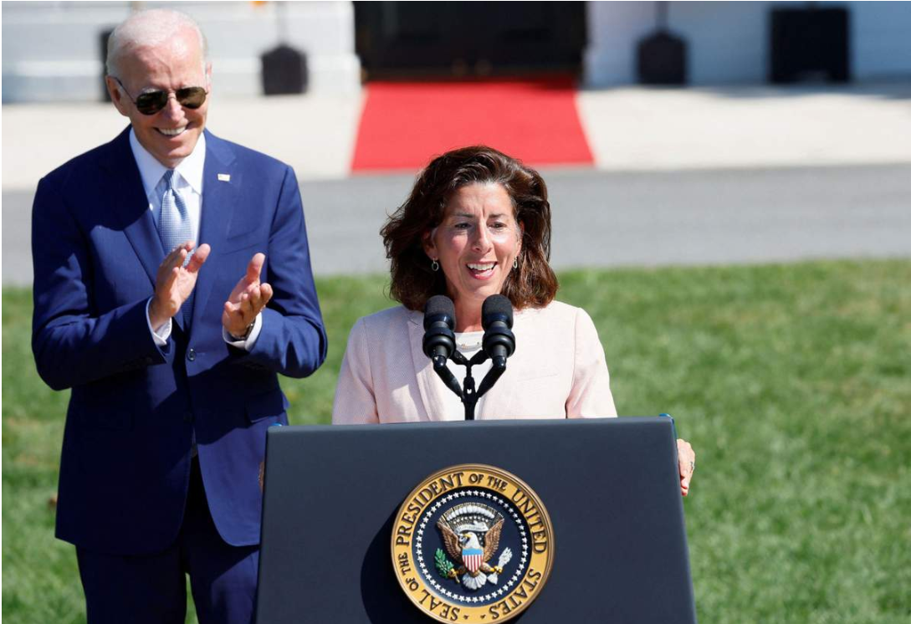

# 今日のニュース (2022-08-12)

### 기사

# **対中関税見直し「複雑化」　米商務長官、議長訪台で**

대중 관세 검토 「복잡화」 미 상무장관, 의장 타이완 방문에서

米**半導体投資**法について話すレモンド米商務長官（右）＝９日、ワシントン（ロイター＝共同）

미 반도체 투자법에 대해 말하는 러몬도 미 상무장관 (오른쪽) = 9일, 워싱턴 (로이터 = 공동)    

レモンド米商務長官は１０日、米国が中国からの輸入品に**課している制裁関税**の見直しについて、**従来**よりも難しくなっているとの**見方**を**示した**。

러몬도 미 상무장관은 10일, 미국이 중국의 수입품에 부과하고 있는 제재관세의 재검토에 대해, 기존보다 어려워지고 있다는 견해를 보였다.

ペロシ米下院議長の**台湾**訪問を受けて「**地政学**的な状況が複雑化した」と**指摘**。

페로시 미 하원 의장의 대만 방문을 받아 「지정학적 상황이 복잡해졌다」고 지적.

中国側との**実務協議**が「現時点では**やや困難**になっている」と述べた。

중국 측과의 실무협의가 「현시점에서는 다소 어려워지고 있다」고 말했다.

米ブルームバーグテレビのインタビューに答えた。

미 블룸버그 TV 인터뷰에 대답했다.

バイデン大統領が国内産業に与える影響を「非常に**用心**深く」**検討**しており、「そう遠からず決定を下すだろう」との**見通し**も示した。

바이든 대통령이 국내 산업에 미치는 영향을 「매우 조심스럽게」 검토하고 있으며, 「그렇게 머지않아 결정을 내릴 것」이라고 전망했다.

バイデン**政権**は物価**高騰対策**の**一環**として、トランプ前政権が**導入**した制裁関税の一部**撤廃**などを検討している。

바이든 정권은 물가 상승 대책의 일환으로, 트럼프 전 정권이 도임한 제재관세의 일부 철폐 등을 검토하고 있다.

レモンド氏は、中国側の協議への関心が低いと明かした上で「より多くの議論を行える環境に戻ると期待している」と述べた。（共同）

러몬도 씨는, 중국 측의 협의에 대한 관심이 낮다고 밝힌 뒤 「더 많은 논의를 실시할 수 있는 환경으로 돌아갈 것으로 기대한다」라고 말했다. (공동)

---

### 학습한 단어

|  | 漢字 | 読み仮名 | 意味 |
| --- | --- | --- | --- |
| 1 | 複雑化 | ふくざつか | 복잡화 |
| 2 | 商務長官 | しょうむちょうかん | 상무장관 |
| 3 | 議長 | ぎちょう | 의장 |
| 4 | 訪台 | ほうたい | 타이완 방문 |
| 5 | 半導体 | はんどうたい | 반도체 |
| 6 | 投資 | とうし | 투자, 출자 |
| 7 | 課する | かする | 부과하다 |
| 8 | 制裁 | せいさい | 제재 |
| 9 | 関税 | かんぜい | 관세 |
| 10 | 従来 | じゅうらい | 종래 |
| 11 | 見方 | みかた | 견해, 생각 |
| 12 | 示す | しめす | 가리키다, 보이다, 나타내다 |
| 13 | 台湾 | たいわん | 대만, 타이완 |
| 14 | 地政学 | ちせいがく | 지정학 |
| 15 | 指摘 | してき | 지적 |
| 16 | 実務 | じつむ | 실무 |
| 17 | 協議 | きょうぎ | 협의 |
| 18 | やや | ・ | 약간, 점점 |
| 19 | 困難 | こんなん | 곤란 |
| 20 | 用心 | ようじん | 조심, 주의, 경계 |
| 21 | 検討 | けんとう | 검토 |
| 22 | 見通し | みとおし | 전망 |
| 23 | 政権 | せいけん | 정권 |
| 24 | 高騰 | こうとう | 물가가 오름 |
| 25 | 対策 | たいさく | 대책 |
| 26 | 一環 | いっかん | 일환 |
| 27 | 導入 | どうにゅう | 도입 |
| 28 | 撤廃 | てっぱい | 철폐 |

---

### 개인적인 생각

전세계적으로 물가 상승으로 인한 어려움이 계속되고 있고, 미국 또한 예외는 아니라는 것을 알았다.

코로나, 우크라이나와 러시아간의 전쟁, 자연재해까지 겹친 현상황이 많이 힘든데 얼른 해결되면 좋겠다.

---

### 출처

[対中関税見直し「複雑化」　米商務長官、議長訪台で](https://www.iza.ne.jp/article/20220811-Z3O4IDMXYRNAJCE6MWLPN6KBDM/?dicbo=v2-ba9297dd7e95eb0f96408b77f5ba1bbc)