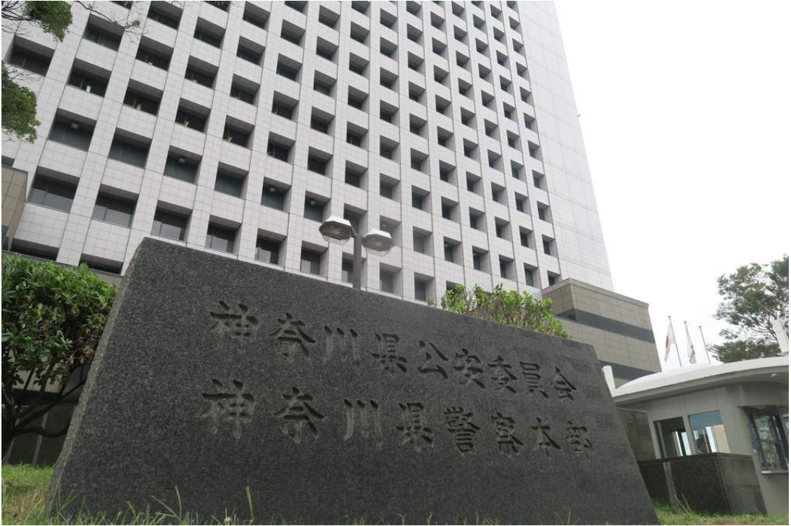

# 今日のニュース (2022-08-13)

### 기사

# **ＳＮＳで知り合った少女を誘拐　４７歳男逮捕**

SNS로 알게 된 소녀를 납치 47세 남자 체포

神奈川県警本部

가나가와현 경본부    

１２日午後３時２０分ごろ、横浜市港南区芹が谷の住宅で、同市内の自宅から行方不明になっていた１０代の少女がいるのを神奈川県警港南署員が発見。

12일 오후 3시 20분경, 요코하마시 고난구 세리가야의 주택에서, 동시내의 자택에서 행방불명이 되어 있던 10대 소녀가 있는 것을 가나가와현 남고난 서원이 발견.

現場にいた男の**身柄**を**確保**した。

현장에 있던 남자의 신변을 확보했다.

**未成年者誘拐**の**疑い**で**現行犯逮捕**されたのは、この住宅の住人で**無職**、岩本敦士容疑者（４７）。

미성년자 유괴 혐의로 현행범 체포된 것은, 이 주택의 주인으로 무직, 이와모토 아츠시 용의자(47).

「家に**かくまって**いたことは間違いありません」と**容疑**を認めている。

「집에 숨겨두고 있던 것은 틀림 없습니다」라고 혐의를 인정하고 있다.

**同署**によると、先月２８日に交流サイト（ＳＮＳ）で**家出**を**ほのめかす投稿**をした少女に対し、岩本容疑者が自宅に泊める**趣旨**のメッセージを送信。

동서에 의하면, 지난달 28일에 교류 사이트(SNS)에서 가출을 암시하는 투고를 한 수녀에 대해, 이와모토 용의자가 자택에 재우는 취지의 메시지를 송신.

**翌日**午前に同区内の**店舗**前で**待ち合わせて誘拐**した。

다음날 오전에 동구 내의 점포 앞에서 만나서 납치했다.

岩本容疑者の自宅で発見された際、少女は居間に座っており、けがはなかった。

이와모토 용의자의 자택에서 발견되었을 때, 소녀는 거실에 앉아 있어, 부상은 없었다.

自宅**付近**の**防犯**カメラに２人の姿が映っているところが確認されていないほか、買い物の**痕跡**などもないことから、２人は２週間外出せずに過ごしていたとみられる。

자택 부근의 방범 카메라에 2명의 모습이 찍힌 곳이 확인되지 않았고, 쇼핑 흔적도 없기 때문에, 2명은 2주간 외출하지 않고 지내고 있었던 것으로 보인다.

岩本容疑者は取り調べに、「少女がかわいそうな**境遇**だと思った」などと**供述**。

이와모토 용의자는 조사에, 「소녀가 불쌍한 처지라고 생각했다」 등이라고 진술.

同署は岩本容疑者に性的な目的があったとみて、少女が**被害**を受けていないかなども含めて**捜査**を進める。

동서는 이와모토 용의자에게 성적인 목적이 있었다고 보고, 소녀가 피해를 받지 않았는지 등도 포함해 조사를 진행한다.

---

### 학습한 단어

|  | 漢字 | 読み仮名 | 意味 |
| --- | --- | --- | --- |
| 1 | 身柄 | みがら | 신변 |
| 2 | 確保 | かくほ | 확보 |
| 3 | 未成年者 | みせいねんしゃ | 미성년자 |
| 4 | 誘拐 | ゆうかい | 유괴 |
| 5 | 疑い | うたがい | 혐의, 의심 |
| 6 | 現行犯 | げんこうはん | 현행범 |
| 7 | 逮捕 | たいほ | 체포 |
| 8 | 無職 | むしょく | 무직 |
| 9 | かくまう | ・ | 몰래 숨겨두다, 은닉하다 |
| 10 | 容疑 | ようぎ | 용의, 혐의 |
| 11 | 同署 | どうしょ | 이 서, 동서 |
| 12 | 家出 | いえで | 가출 |
| 13 | ほのめかす | ・ | 암시하다 |
| 14 | 投稿 | とうこう | 투고 |
| 15 | 趣旨 | しゅし | 취지 |
| 16 | 翌日 | よくじつ | 이튿날, 다음날 |
| 17 | 店舗 | てんぽ | 점포, 가게 |
| 18 | 待ち合わせる | まちあわせる | 시간・장소를 미리 정하고 만나기로 하다 |
| 19 | 誘拐 | ゆうかい | 유괴 |
| 20 | 付近 | ふきん | 부근, 근처 |
| 21 | 防犯 | ぼうはん | 방범 |
| 22 | 痕跡 | こんせき | 흔적 |
| 23 | 境遇 | きょうぐう | 경우, 처지, 형편, 환경 |
| 24 | 供述 | きょうじゅつ | 공술, 진술 |
| 25 | 被害 | ひがい | 피해 |
| 26 | 捜査 | そうさ | 수사 |

---

### 개인적인 생각

가출 청소년 문제는 국내에서도 큰 문제인 걸로 알고 있다.

가출 청소년이 생기지 않도록 방지하고, 설령 생기더라도 이들을 지원해줄 수 있는 방책이 생겨야 한다고 생각한다.

---

### 출처

[ＳＮＳで知り合った少女を誘拐　４７歳男逮捕](https://www.iza.ne.jp/article/20220812-NKQJC3LVS5OPXM46OHPBEPWI3Q/)