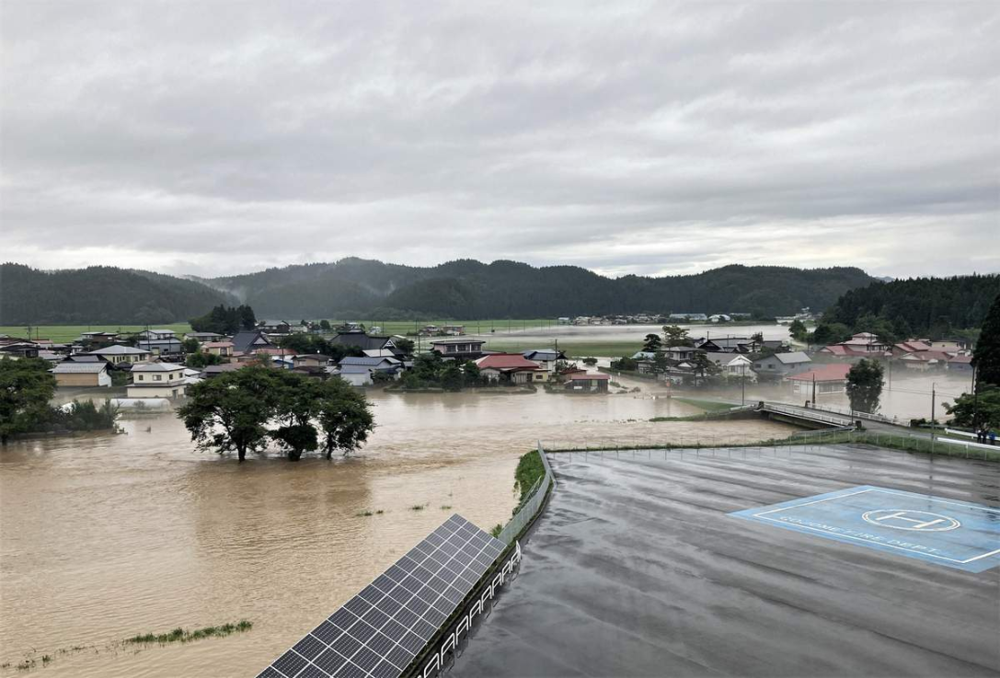

# 今日のニュース (2022-08-14)

### 기사

# **秋田で記録的大雨の被害拡大　河川氾濫相次ぐ**

아키타에서 기록적 폭우의 피해 확대 하천 범람 잇따라

右中央の**橋**の下を右から左に流れる富津**内川**の**氾濫**で、**沿岸**の**畑**や道路、**集落**、奥の**水田**が泥水に**浸かった**。右手前は**消防**ヘリポート＝１３日午前６時ごろ、秋田県五城目町（秋田県提供）

오른쪽 중앙의 다리 아래로 오른쪽에서 왼쪽으로 흐르는 훗쓰내천의 범람으로, 연안의 밭과 도로, 취락, 안쪽의 논이 흙탕물에 잠겼다. 오른쪽 앞은 소방헬기장 = 13일 오전 6시경, 아키타현 고죠메초 (아키타현 제공)

**記録的**大雨が続く秋田県で１３日、新たに五城目町や由利本荘市で３河川が氾濫したほか、**がけ崩れ**や道路**損壊**など、**被害**は**延べ**１４市町村に拡大した。

기록적 폭우가 이어지는 아키타현에서 13일, 새롭게 고죠메쵸나 유리혼조시에서 3개 하천이 범람한 것 외에, 벼랑이 무너지는 사태와 도로 손괴 등, 피해는 총 14개 시정촌으로 확대됐다.

大雨は今後も続く予想で、県は**災害対策本部**で被災状況の**把握**を急ぐとともに、県民に一層の注意を呼びかけた。

폭우는 앞으로도 계속될 전망으로, 현은 재해 대책 본부에서 재해 상황의 파악을 서두르면서, 현민에게 한층 더 주의를 호소했다.

県内は９日から県北部で**断続的**に記録的な大雨となり、１２日夜から１３日**未明**までの３時間に五城目町から北秋田市にかけて８０～１２０ミリ、大館市と鹿角市で８０～１５０ミリを記録した。

현내는 9일부터 현 북부에서 간헐적으로 기록적인 폭우가 되어, 12일 밤부터 13일 미명까지의 3시간에 고죠메쵸에서 키타아키타시에 걸쳐 80~120밀리, 오다테시와 가가쿠시에서 80~150밀리를 기록했다.

このため五城目町の内川川（うちかわがわ）が約４・５キロ、同川が**合流**する富津内川（ふつないがわ）が１・５キロにわたり氾濫し、沿岸の住宅５２棟が**床上浸水**、５９棟が床下浸水し、**農作業小屋**など**非住戸**７５棟も浸水。

이 때문에 고죠메쵸의 우치카와가와가 약 4・5킬로, 동천이 합류하는 후츠나가와가 1・5킬로에 걸쳐 범람해, 연안의 주택 52동이 마루 밑까지 침수해, 농작업 가옥 등 75동도 침수.

水田なども**広範囲**にわたり**泥水**に浸かった。

논 등도 광범위하게 진흙탕에 잠겼다.

北秋田市では秋田内陸線の米内沢―阿仁前田温泉間で、**線路わき**の**斜面**や**路肩**が**崩落**したほか、**倒木**や通信ケーブル**破断**があり、**同線**は**全線**で**運休**した。

키타아키시에서는 아키타 내륙선의 미나이자와-아인마에다 온천간에서, 선로 옆의 사면이나 갓길이 붕괴한 것 외, 쓰러진 나무나 통신 케이블에 파단이 있어, 동선은 전 노선에서 운휴했다.

鹿角市では旧尾去沢**鉱山**の**廃水処理所**が**落雷**で**停電**し、**銅**や**亜鉛**などを含む**未処理水**が一部あふれ出た。

카즈노시에서는 구미거택 광산의 폐수처리소가 낙뢰로 정전해, 구리나 아연 등을 포함한 미처리수가 흘러 나왔다.

県南部の由利本荘市でも午前１０時前に芋川が加賀沢橋周辺で氾濫し、同市などが被害状況を調べている。

현 남부의 유리혼조시에서도 오전 10시 전에 시바가와가 카가사와바시 주변에서 범람해, 동시 등이 피해 상황을 조사하고 있다.

---

### 학습한 단어

---

|  | 漢字 | 読み仮名 | 意味 |
| --- | --- | --- | --- |
| 1 | 橋 | はし | 다리 |
| 2 | 氾濫 | はんらん | 범람 |
| 3 | 沿岸 | えんがん | 연안 |
| 4 | 畑 | はたけ | 밭 |
| 5 | 集落 | しゅうらく | 도시나 촌락 |
| 6 | 水田 | みずだ | 논 |
| 7 | 浸かる | つかる | 잠기다 |
| 8 | 消防 | しょうぼう | 소방 |
| 9 | 記録的 | きろくてき | 기록적 |
| 10 | がけ崩れ | がけくずれ | (산비탈・벼랑의)사태 |
| 11 | 損壊 | そんかい | 손괴 |
| 12 | 被害 | ひがい | 피해 |
| 13 | 延べ | のべ | 합계, 총계 |
| 14 | 災害対策本部 | さいがいたいさくほんぶ | 재해 대책 본부 |
| 15 | 把握 | はあく | 파악 |
| 16 | 断続的 | だんぞくてき | 단속적 |
| 17 | 未明 | みめい | 미명 |
| 18 | 合流 | ごうりゅう | 합류 |
| 19 | 床上浸水 | ゆかうえしんすい | 마루 위까지의 침수 |
| 20 | 農作業 | のうさぎょう | 농사일 |
| 21 | 小屋 | しょうおく、こや | 소옥, 오두막집, 임시로 세운 건물, 가옥 |
| 22 | 非住戸 | ひじゅうこ | 비주택 |
| 23 | 広範囲 | こうはんい | 광범위 |
| 24 | 泥水 | どろみず | 흙탕물 |
| 25 | 線路わき | せんろわき | 선로 옆 |
| 26 | 斜面 | しゃめん | 사면, 경사면 |
| 27 | 路肩 | ろかた | 갓길 |
| 28 | 崩落 | ほうらく | 붕락 |
| 29 | 倒木 | とうぼく | 쓰러진 나무 |
| 30 | 破断 | はだん | 파단 |
| 31 | 同線 | どうせん | 동선 |
| 32 | 全線 | ぜんせん | 전선 |
| 33 | 運休 | うんきゅう | 운휴 |
| 34 | 鉱山 | こうざん | 광산 |
| 35 | 廃水処理所 | はいすいしょりじょ | 폐수 처리소 |
| 36 | 落雷 | らくらい | 낙뢰 |
| 37 | 停電 | ていでん | 정전 |
| 38 | 銅 | どう | 구리 |
| 39 | 亜鉛 | あえん | 아연 |
| 40 | 未処理水 | みしょりすい | 미처리수 |

### 개인적인 생각

한국도 최근 폭우로 인해 서울을 비롯한 곳곳에서 피해가 잇따랐는데 일본에서도 폭우로 인해 큰 피해를 겪고 있다는 것이 안타까웠다.

최근 전세계적으로 자연재해가 잇따르고 있는데 하루빨리 완화되면 좋겠다고 느꼈다.

---

### 출처

[秋田で記録的大雨の被害拡大　河川氾濫相次ぐ](https://www.iza.ne.jp/article/20220813-B7TOFFJW7FMW5HSG6I7R3TSEAM/)