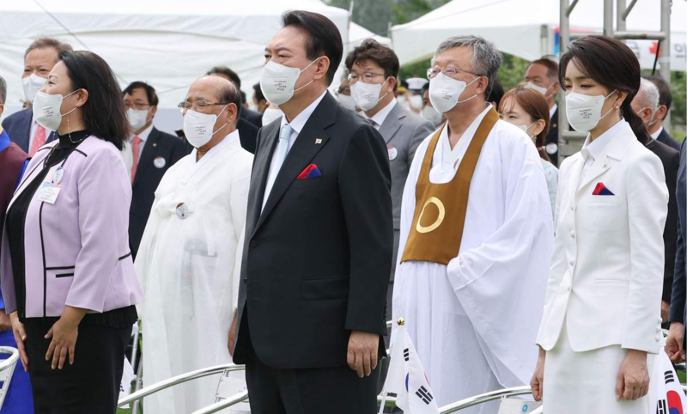

# 今日のニュース (2022-08-16)

### 기사

# **尹大統領が日本に「共に脅威に立ち向かう隣人」と呼びかけ　光復節演説**

윤 대통령이 일본에 「함께 위협에 맞서는 이웃」 이라고 부르는 광복절 연설

「光復節」の**式典**に出席した韓国の尹錫悦大統領（中央）ら＝１５日、ソウル（聯合＝共同）

「광복절」 식전에 참석한 한국의 윤석열 대통령 (중앙) 등 = 15일, 서울 (연합 = 공동)

【ソウル＝桜井紀雄】韓国で１５日、日本の**朝鮮半島統治**からの**解放**を記念する「光復節」を迎え、政府式典が開かれた。

【서울 = 사쿠라이 노리오】 한국에서 15일, 일본의 한반도 통치에서의 해방을 기념하는 「광복절」을 맞아, 정부식전이 열렸다.

尹錫悦（ユン・ソンニョル）大統領は演説で、日本について「いまや、世界市民の自由を**脅かす挑戦**に**立ち向かい**、共に力を合わせて進むべき**隣人**だ」と指摘。

윤석열 대통령은 연설에서, 일본에 대해 「지금, 세계 시민의 자유를 위협하는 도전에 맞서, 함께 힘을 합쳐 나가야할 이웃이다」 라고 지적.

日韓関係を**早期**に**修復**し、**発展**させると**強調**した。

한일 관계를 조기에 수복하고, 발전시키겠다고 강조했다.

**いわゆる徴用工訴訟**など日韓間の**懸案**を**念頭**に、日韓関係が「**普遍的**価値を**基盤**に両国の未来や時代の使命に向かって進むなら歴史問題もきちんと解決できる」と**訴え**、１９９８年の当時の金大中（キム・デジュン）大統領と小渕恵三首相による日韓共同**宣言**の**継承**を改めて**掲げた**。

이른바 징용공 소송 등 한일 간 현안을 염두에 두고, 한일 관계가 「보편적 가치를 기반으로 양국의 미래나 시대의 사명을 향해 나아간다면 역사 문제도 제대로 해결할 수 있다」고 촉구하며, 1998년 당시의 김대중 대통령과 오부치 게이조 총리의 한일 공동선언 승계를 재차 내세웠다.

両国の政府や国民が「互いに**尊重**し、経済や安全**保障**、社会、文化にわたる**幅広い**協力を通じて国際社会の平和と**繁栄**に共に**寄与**しなければならない」とも述べた。

양국의 정부나 국민이 「서로 존중하고, 경제나 안보, 사회, 문화에 걸친 폭넓은 협력을 통해 국제사회의 평화와 번영에 함께 기여해야 한다」고도 말했다.

具体的な関係改善策の**提示**はなかった。

구체적인 관계 개선책의 제시는 없었다.

北朝鮮に対しては、**核**開発を**中断**し、「**実質的**な**非核化**」に**転換**すれば、「その**段階**に合わせて北朝鮮の経済や国民生活を**画期的**に改善できる**大胆な構想**」を提案するとし、**食糧支援**や発電などのインフラ、農業、医療、**金融**など**多方面**に**及ぶ支援策**を提示した。

북한에 대해서는, 핵개발을 중단하고, 「실질적인 비핵화」로 전환하면, 「그 단계에 맞춰 북한의 경제와 국민생활을 획기적으로 개선할 수 있는 대담한 구상」을 제안한다며, 식량 지원이나 발전 등 인프라, 농업, 의료, 금융 등 다방면에 걸친 지원책을 제시했다.

---

### 학습한 단어

---

|  | 漢字 | 読み仮名 | 意味 |
| --- | --- | --- | --- |
| 1 | 式典 | しきてん | 식전, 의식 |
| 2 | 朝鮮 | ちょうせん | 조선 |
| 3 | 半島 | はんとう | 반도 |
| 4 | 統治 | とうち | 통치 |
| 5 | 解放 | かいほう | 해방 |
| 6 | 脅かす | おどかす | 위협하다 |
| 7 | 挑戦 | ちょうせん | 도전 |
| 8 | 立ち向かう | たちむかう | 당면하다, 직면하다, 맞서다, 대항하다 |
| 9 | 隣人 | りんじん | 이웃 |
| 10 | 早期 | そうき | 조기 |
| 11 | 修復 | しゅうふく | 수복, 복원 |
| 12 | 発展 | はってん | 발전 |
| 13 | 強調 | きょうちょう | 강조 |
| 14 | いわゆる | ・ | 이른바 |
| 15 | 徴用工 | ちょうようこう | 징용공 |
| 16 | 訴訟 | そしょう | 소송 |
| 17 | 懸案 | けんあん | 현안 |
| 18 | 念頭 | ねんとう | 염두, 마음속 |
| 19 | 普遍的 | ふへんてき | 보편적 |
| 20 | 基盤 | きばん | 기반 |
| 21 | 訴え | うったえ | 호소, 소송 |
| 22 | 宣言 | せんげん | 선언 |
| 23 | 継承 | けいしょう | 계승 |
| 24 | 掲げる | かかげる | 내걸다, 내세우다 |
| 25 | 尊重 | そんちょう | 존중 |
| 26 | 保障 | ほしょう | 보장 |
| 27 | 幅広い | はばひろい | 폭넓다 |
| 28 | 繁栄 | はんえい | 번영 |
| 29 | 寄与 | きよ | 기여 |
| 30 | 提示 | ていじ | 제시 |
| 31 | 核 | かく | 핵 |
| 32 | 中断 | ちゅうだん | 중단 |
| 33 | 実質的 | じっしつてき | 실질적 |
| 34 | 非核化 | ひかくか | 비핵화 |
| 35 | 転換 | てんかん | 전환 |
| 36 | 段階 | だんかい | 단계 |
| 37 | 画期的 | かっきてき | 획기적 |
| 38 | 大胆な | だいたんな | 대담한 |
| 39 | 構想 | こうそう | 구상 |
| 40 | 食糧支援 | しょくりょうしえん | 식량 지원 |
| 41 | 金融 | きんゆう | 금융 |
| 42 | 多方面 | たほうめん | 다방면 |
| 43 | 及ぶ | およぶ | 미치다, 달하다, 이르다 |
| 44 | 支援策 | しえんさく | 지원책 |

### 개인적인 생각

어제는 일본의 지배에서 해방된 광복절이었다.

우리나라의 해방을 위해 노력하셨던 독립운동가분께 감사하고, 앞으로의 일본과의 관계 또한 어떻게 되는 것이 좋을지에 대해 생각해보는 시간을 가져보았다.

---

### 출처

[尹大統領が日本に「共に脅威に立ち向かう隣人」と呼びかけ　光復節演説](https://www.iza.ne.jp/article/20220815-2JZLMQO2MJJKXPG3SKEMEMCO6U/)