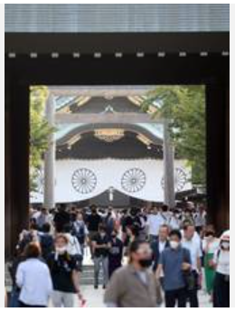

# 今日のニュース (2022-08-17)

### 기사

# **「靖国神社への礼は止められない慣習」韓国高官が一定の理解**

「야스쿠니 신사에 대한 예는 멈출 수 없는 관습」 한국 고관이 일정한 이해(?)

終戦の日を迎え靖国神社を参拝する人々＝１５日午後、東京都千代田区（鴨志田拓海撮影）

종전의 날을 맞이해 야스쿠니 신사를 참배하는 사람들 = 15일 오후, 도쿄도 지요다구(가모시다 타쿠미 촬영)

【ソウル＝桜井紀雄】**大統領府高官**は１５日、靖国神社への**閣僚**の**参拝**や岸田文雄首相の**玉串料奉納**を受け、「靖国神社へ日本の指導者が何らかの方法で礼を**表す**のは止められない慣習になっている」と**記者団**に説明し、一定の理解を示した。

【서울=사쿠라이 기오】 청와대 고관은 15일, 야스쿠니 신사 각료 참배와 기시다 후미오 총리의 공물 봉납에 대해, 「야스쿠니 신사에 일본의 지도자가 어떠한 방식으로 예를 표하는 것은 멈출 수 없는 관습이 되어 있다」고 기자들에게 설명하며, 일정한 이해를 나타냈다.

高官は、首相の玉串料奉納について「**事前**に韓国側に説明があった」と明らかにし、日韓両政府間で「**大枠**では非常に**緊密**に**対話**が進んでいる」と述べた。

고관은, 총리의 공물 봉납에 대해 「사전에 한국 측에 설명이 있었다」고 밝혔고, 한일 양 정부 간에 「큰 틀에서는 매우 긴밀하게 대화가 진행되고 있다」고 말했다.

一方、韓国外務省は１５日、「深い失望と**遺憾**の**意**を表明する」との**報道官論評**を発表した。

한편, 한국 외무성은 15일, 「깊은 실망과 유감의 뜻을 표명한다」는 보도관 논평을 발표했다.

論評は、靖国神社について「**侵略**戦争を**美化**し、戦争犯罪者を**合祀**（ごうし）した」と指摘。

논평은 야스쿠니 신사에 대해 「침략 전쟁을 미화하고, 전쟁 범죄자를 합사했다」고 지적.

韓国政府として「日本の責任ある人たちが歴史を直視し、**真摯**（しんし）な反省を行動で示すこと」を求めた。

한국 정부로서 「일본의 책임 있는 사람들이 역사를 직시하고, 진지한 반성을 행동으로 보여줄 것」을 요구했다.

---

### 학습한 단어

|  | 漢字 | 読み仮名 | 意味 |
| --- | --- | --- | --- |
| 1 | 慣習 | かんしゅう | 관습 |
| 2 | 高官 | こうかん | 고관 |
| 3 | 終戦 | しゅうせん | 종전 |
| 4 | 参拝 | さんぱい | 참배 |
| 5 | 大統領 | だいとうりょう | 대통령 |
| 6 | 閣僚 | かくりょう | 각료 |
| 7 | 玉串料 | たまぐしりょう | 의식에서, 신전에 바치는 공물 |
| 8 | 奉納 | ほうのう | 봉납 |
| 9 | 表す | ひょうす・あらわす | 표하다, 나타내다, 표현하다 |
| 10 | 記者団 | きしゃだん | 기자단 |
| 11 | 事前 | じぜん | 사전 |
| 12 | 大枠 | おおわく | 큰 틀 |
| 13 | 緊密 | きんみつ | 긴밀 |
| 14 | 対話 | たいわ | 대화 |
| 15 | 遺憾 | いかん | 유감 |
| 16 | 意 | い | 마음, 뜻 |
| 17 | 報道官 | ほうどうかん | 대변인 |
| 18 | 論評 | ろんぴょう | 논평 |
| 19 | 侵略 | しんりゃく | 침략 |
| 20 | 美化 | びか | 미화 |
| 21 | 合祀 | ごうし | 합사 |
| 22 | 真摯 | しんし | 진지 |

---

### 개인적인 생각

우리에게 광복절이 축하할 날이라면, 일본 국민에게 있어서는 추모해야할 날이라는 것에 대해서는 인지하고 있지만, 여전히 한국 국민으로서 전범들을 기리는 야스쿠니 신사에서 일본 고위 관리들이 참배를 하는 것을 보는 데에는 거부감이 드는 것이 사실이다.

---

### 출처

[「靖国神社への礼は止められない慣習」韓国高官が一定の理解](https://www.iza.ne.jp/article/20220815-HV2FI35J7RPNHD6OEOC6KBYH4Q/)