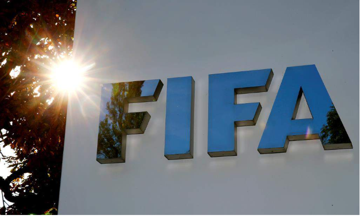

# 今日のニュース (2022-08-20)

### 기사

# **サッカーＷ杯カタール大会、チケット２４５万枚販売**

축구 월드컵 카타르 대회, 티켓 245만장 판매

FIFAのロゴ(ロイター)

FIFA 로고(로이터)    

国際サッカー**連盟**（ＦＩＦＡ）は１８日、ワールドカップ（Ｗ杯）カタール大会のチケット販売が計２４５万枚に**達した**と発表した。

국제축구연맹(FIFA)은 18일, 월드컵 카타르 대회 티켓 판매가 총 245만장에 달했다고 발표했다.

７月５日から８月１６日までの期間で約５２万枚が売れた。

7월 5일부터 8월 16일까지의 기간에 약 52만장이 팔렸다.

**国別**ではカタール、米国、英国、サウジアラビア、メキシコなどからの**購入**が多かった。

국가별로는 카타르, 미국, 영국, 사우디아라비아, 멕시코 등에서의 구입이 많았다.

１次リーグの試合別では８万人**収容**のルサイル**競技場**で行われるブラジルの２試合や、日本と同じＥ組のコスタリカ―ドイツなどが多く売れた。

1차 리그 경기별로는 8만명 수용의 루사일 경기장에서 열리는 브라질 2경기나, 일본과 같은 E조의 코스타리카-독일 등이 많이 팔렸다.

最終販売の開始時期は９月下旬にＦＩＦＡ公式サイトで発表される。（共同）

최종 판매의 개시 시기는 9월 하순에 FIFA 공식 사이트에서 발표된다. (공동)

---

### 학습한 단어

|  | 漢字 | 読み仮名 | 意味 |
| --- | --- | --- | --- |
| 1 | 連盟 | れんめい | 연맹 |
| 2 | 達する | たっする | 달하다, 도달하다, 이르다 |
| 3 | 国別 | くにべつ | 나라별 |
| 4 | 購入 | こうにゅう | 구입 |
| 5 | 収容 | しゅうよう | 수용 |
| 6 | 競技場 | きょうぎじょう | 경기장 |

---

### 개인적인 생각

평소에도 축구를 즐겨보는 편인데 리그 경기와는 다른 즐거움이 있는 월드컵이 빨리 개최되면 좋겠다.

---

### 출처

[サッカーＷ杯カタール大会、チケット２４５万枚販売](https://www.iza.ne.jp/article/20220818-IHZF55PRYFMKTANO7V3F34CR7E/)