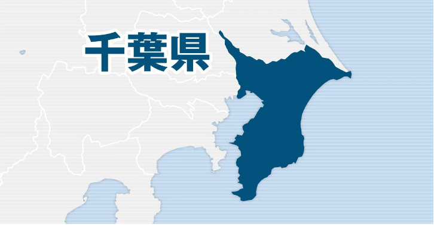

# 今日のニュース (2022-08-21)

### 기사

# **強盗被害車両か、車横転で運転の男性死亡　千葉**

강도 피해 차량인가, 차 옆으로 넘어져 운전하던 남성 사망 치바

   

１９日午前１０時４０分ごろ、千葉県君津市南子安の**国道**１２７号で、**軽乗用車**が**横転**し、運転していた男性が死亡した。

19일 오전 10시 40분쯤, 치바현 키미츠시 미나미코야스의 국도 127호에서, 경승용차가 옆으로 넘어져, 운전하고 있던 남성이 사망했다.

軽乗用車は事故の直前、男に**強奪**されており、県警君津署が死亡した男性と**強盗**事件の関連を調べている。

경승용차는 사고 직전, 남자에게 강탈당하고 있으며, 현 경군진서가 사망한 남성과 강도 사건의 관계를 조사하고 있다.

署や**消防**によると、事故の数分前、君津市内のコンビニの**駐車場**で４０～６０代の男が軽乗用車の**運転席**に**乗り込み**、**助手席**にいた２０代女性を乗せたまま**発進**、女性から「助けて。運転されている」と１１０番通報があった。

서나 소방에 의하면, 사고 몇 분 전, 키미츠 시내의 편의점 주차장에서 40~60대의 남자가 경승용차의 운전석에 탑승해, 조수석에 있던 20대 여성을 태운 채로 발진, 여성으로부터 「도와줘. 운전되고 있다」고 110번 신고가 접수됐다.

軽乗用車は国道を他の車などにぶつかりながら**走行**、女性は途中で降ろされた。

경승용차는 국도를 다른 차 등에 부딪히면서 주행, 여성은 도중에 내려졌다.

軽乗用車は現場から約３キロ離れた場所で横転した。

경승용차는 현장에서 약 3km 떨어진 곳에서 전복됐다.

女性は背中に軽いけが。署は死亡した男性の身元確認を進めるとともに、事故の原因を調べる。

여성은 등에 가벼운 부상. 경찰서는 사망한 남성의 신원 확인을 진행시키는 것과 동시에, 사고의 원인을 조사한다.

---

### 학습한 단어

|  | 漢字 | 読み仮名 | 意味 |
| --- | --- | --- | --- |
| 1 | 国道 | こくどう | 국도 |
| 2 | 軽乗用車 | けいじどうしゃ | 경승용차 |
| 3 | 横転 | おうてん | 횡전, 전도, 뒹굶, 전복 |
| 4 | 強奪 | ごうだつ | 강탈 |
| 5 | 強盗 | ごうとう | 강도 |
| 6 | 消防 | しょうぼう | 소방 |
| 7 | 駐車場 | ちゅうしゃじょう | 주차장 |
| 8 | 乗り込み | のりこみ | 올라탐, 진입함 |
| 9 | 助手席 | じょしゅせき | 조수석 |
| 10 | 発進 | はっしん | 발진 |
| 11 | 走行 | そうこう | 주행 |

---

### 개인적인 생각

기사의 내용만 보아서는 어떠한 경위로 사고가 발생했는지 알 수가 없었다.

삼가 고인의 명복을 빌고, 어떠한 원인으로 사고가 발생했는지 밝혀지면 하는 바램이다.

---

### 출처

[強盗被害車両か、車横転で運転の男性死亡　千葉](https://www.iza.ne.jp/article/20220819-EQAYS6Z2XNOMVP7SOS765K2IGA/)