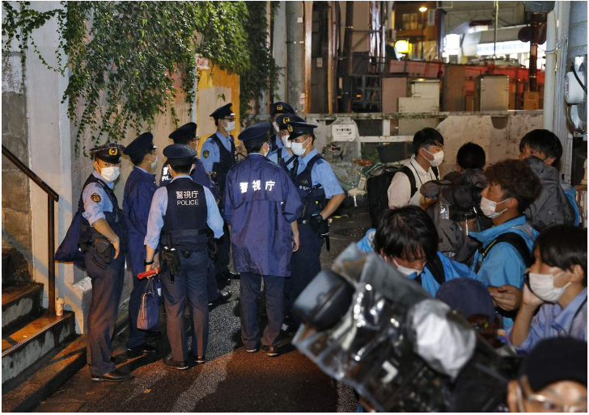

# 今日のニュース (2022-08-22)

### 기사

# **渋谷で母子が刃物で襲われる　通り魔か、殺人未遂容疑で女逮捕　警視庁**

시부야에서 모자가 칼로 습격당하다 묻지마 범죄인가, 살인미수 혐의로 여자 체포 경시청

母と娘が**刺された**東京都渋谷区の現場**付近**＝２０日午後９時２４分

어머니와 딸이 찔린 도쿄도 시부야구의 현장 부근 = 20일 오후 9시 24분

２０日午後７時２５分ごろ、東京都渋谷区で、女性２人が刃物を持った女に**襲われ**、**通行人**から「けが人が出ている」などと１１０番通報があった。

20일 오후 7시 25분쯤, 도쿄도 시부야구에서, 여성 2명이 칼을 가진 여자에게 습격당해, 통행인에게 「부상자가 나오고 있다」 등 110번 신고가 있었다.

警視庁渋谷署によると、襲われたのは５０代の女性と１０代の娘とみられる。

경시청 시부야서에 의하면, 습격당한 것은 50대 여성과 10대 딸로 보인다.

５０代の女性が女を**取り押さえ**、女は殺人未遂の疑いで**現行犯**逮捕された。

50대 여성이 여자를 잡고, 여자는 살인미수 혐의로 현행범 체포되었다.

襲われた母子は刺されるなどして病院に**搬送**されたが、命に**別条**はないという。

습격당한 모자는 찔리는 등 병원으로 호송되었지만, 생명에 지장은 없다고 한다.

渋谷署によると、女は１０代で、**路上**で母子を襲ったとみられるという。

시부야서에 의하면, 여자는 10대로, 거리에서 모자를 덮친 것으로 보인다고 한다.

母子は女について「知らない」などと話しており、渋谷署は通り魔事件の可能性もあるとみて調べている。

모자는 여자에 대해 「몰라」 등이라고 말하고 있으며, 시부야서는 묻지마 범죄의 가능성도 있다고 보고 조사하고 있다.

---

### 학습한 단어

|  | 漢字 | 読み仮名 | 意味 |
| --- | --- | --- | --- |
| 1 | 通り魔 | とおりま | 묻지마 범죄 |
| 2 | 刺された | さされた | 찔렸다 |
| 3 | 付近 | ふきん | 부근, 근처 |
| 4 | 襲う | おそう | 습격하다, 덮치다 |
| 5 | 通行人 | つうこうにん | 통행인 |
| 6 | 取り押さえる | とりおさえる | 억누르다, 붙잡다, 붙들다 |
| 7 | 現行犯 | げんこうはん | 현행범 |
| 8 | 搬送 | はんそう | 반송 |
| 9 | 別条 | べつじょう | 별일, 별다른 일 |
| 10 | 路上 | ろじょう | 노상, 길위, 거리 |

---

### 개인적인 생각

한국에서도 묻지마 범죄에 대해 이슈가 되었던 적이 있었는데 다행히 생명에 지장이 없다고 하니 잘 치료되었으면 하고, 가해자는 강도 높은 처벌을 받았으면 하는 바램이다.

---

### 출처

[渋谷で母子が刃物で襲われる　通り魔か、殺人未遂容疑で女逮捕　警視庁](https://www.iza.ne.jp/article/20220820-RNYHQL7I7ZPMHA4ZFEVTPD3GCA/)