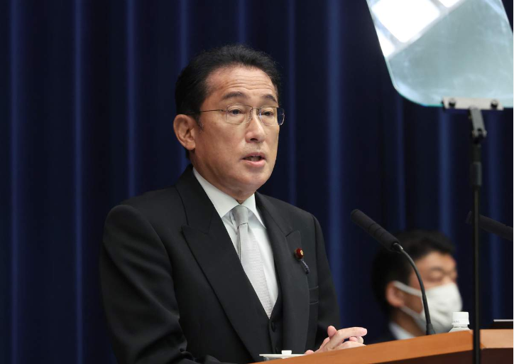

# 今日のニュース (2022-08-23)

### 기사

# **首相コロナ感染　２５日からの外遊とりやめ**

총리 코로나 감염 25일부터 외유 취소

岸田文雄首相＝１０日午後、首相**官邸**（春名中撮影）

기시다 후미오 총리 = 10일 오후, 총리 관저 (봄 명중 촬영)    

政府は２１日、岸田文雄首相が新型コロナウイルスに感染したと発表した。

정부는 21일, 기시다 후미오 총리가 신형 코로나 바이러스에 감염됐다고 발표했다.

２０日夜から**微熱**やせきなどの症状があり、２１日に首相**公邸**でＰＣＲ検査を受けたところ、**陽性**が判明した。

20일 밤부터 미열이나 기침 등의 증상이 있었고, 21일에 총리 공저에서 PCR 검사를 받았는데, 양성이 밝혀졌다.

公邸で**療養**中で、２１日午後時点で症状が続いている。

공저에서 요양 중이며, 21일 오후 시점에서 증상이 계속되고 있다.

首相周辺によれば療養期間は現時点では３０日までで、首相**臨時**代理は置かず、早ければ２２日からオンラインで**公務**を行う。

총리 주변에 의하면 치료기간은 현시점에서는 30일까지로, 총리 임시 대리는 두지 않고, 이르면 22일부터 온라인으로 공무를 진행한다.

２５日から予定していた外遊はとりやめる。

25일부터 예정하고 있던 외유는 그만둔다.

２７～２８日にチュニジアで開催されるアフリカ開発会議（ＴＩＣＡＤ）はオンライン出席を検討し、中東訪問は延期する。

27~28일 튀니지에서 개최되는 아프리카 개발 회의(TICAD)는 온라인 출석을 검토하고, 중동 방문은 연기한다.

首相の**濃厚接触者**に認定されたのは裕子夫人と、長男で**秘書**を**務める**翔太郎氏。

총리의 농후 접촉자로 인정된 것은 유코 부인과 장남으로 비서를 맡은 쇼타로씨.

感染**経路**は判明していないという。

감염 경로는 밝혀지지 않았다고 한다.

首相は１５日に全国**戦没者追悼式**などに出席後、夏休みに入り、１６日は家族らとゴルフ場でラウンド。

총리는 15일에 전국 전몰자 추도식 등에 참여 후, 여름휴가에 들어서, 16일에는 가족들과 골프장에서 라운드.

１７～１９日には家族と静岡県伊豆の国市の温泉旅館に宿泊し、２０、２１両日は公邸で過ごした。

17~19일에는 가족과 시즈오카현 이즈노쿠니시의 온천 연관에 숙박해, 20, 21 양일은 공저에서 보냈다.

２２日に公務に復帰する予定だった。

22일에 공무에 복귀할 예정이었다.

日本の首相の感染判明は初めて。

일본 총리의 감염 판명은 처음이다.

---

### 학습한 단어

|  | 漢字 | 読み仮名 | 意味 |
| --- | --- | --- | --- |
| 1 | 外遊 | がいゆう | 외유 |
| 2 | 官邸 | かんてい | 관저 |
| 3 | 微熱 | びねつ | 미열 |
| 4 | 公邸 | こうてい | 공저, 관저 |
| 5 | 陽性 | ようせい | 양성 |
| 6 | 療養 | りょうよう | 요양 |
| 7 | 臨時 | りんじ | 임시 |
| 8 | 公務 | こうむ | 공무 |
| 9 | 濃厚接触者 | のうこうせっしょくしゃ | 밀접 접촉자 |
| 10 | 経路 | けいろ | 경로 |
| 11 | 秘書 | ひしょ | 비서 |
| 12 | 務める | つとめる | 맡다 |
| 13 | 戦没者 | せんぼつしゃ | 전몰자 (전사의 격식 차린 말) |
| 14 | 追悼式 | ついとうしき | 추도식 |

---

### 개인적인 생각

일본에서도 한국과 마찬가지로 코로나 감염자수가 치닿고 있는 것으로 알고 있는데 얼른 코로나 사태가 진정되면 좋겠다.

---

### 출처

[首相コロナ感染　２５日からの外遊とりやめ](https://www.iza.ne.jp/article/20220821-SUPBRDAAC5IAZDBFNSLRRJXIRI/)