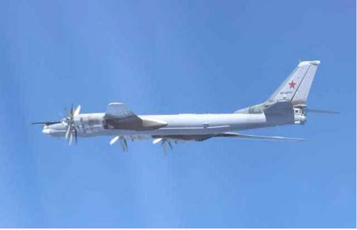

# 今日のニュース (2022-08-25)

### 기사

# **ロシア戦略爆撃機が日本周辺飛行　韓国の防空識別圏に進入**

러시아 전략폭격기가 일본 주변 비행 한국의 방공식별권에 진입

ロシアのＴＵ９５爆撃機（防衛省統合幕僚監部提供）

러시아의 TU95 폭격기 (방위성 통합 막료 감부 제공)    

露**国防省**は２３日、２機のＴＵ９５**戦略爆撃機**が日本海上空で**哨戒**飛行を実施したと発表した。

러국방성은 23일, 2대의 TU95 전략폭격기가 일본해 상공에서 초계 비행을 실시했다고 발표했다.

日本周辺で戦略爆撃機を飛行させることで、ウクライナを支援する日米両国に**圧力**をかける**思惑**があるとみられる。

일본 주변에서 전략폭격기를 비행시킴으로서 우크라이나를 지원하는 미일 양국에 압력을 가할 생각이 있는 것으로 보인다.

同省の発表によると、ＴＵ９５を**護衛**する戦闘機スホイ３０も同行。

동성의 발표에 의하면, TU95를 호위하는 전투기 스호이 30도 동행.

飛行は約７時間にわたった。

비행은 약 7시간에 걸쳐 있었다.

飛行ルートの一部で韓国**空軍**のＦ１６**戦闘機**に**追尾**されたと明らかにした。

비행 루트의 일부로 한국 공군의 F16 전투기에 추적 당했다고 밝혔다.

ロシア側は飛行は事前に予定された定期的なもので、国際法に**違反**せず**実施**したと**主張**している。

러시아 측은 비행은 사전에 예정된 정기적인 것으로, 국제법을 위반하지 않고 실시했다고 주장하고 있다.

ロイター通信によると、韓国軍**当局**はＦ１６戦闘機を**発進**させたことについて、露軍機が韓国の防空識別圏（ＡＤＩＺ）に進入したため、**所定**の対応**措置**を取ったと説明した。

로이터 통신에 의하면, 한국군 당국은 F16 전투기를 발진시킨 것에 대해, 러시아군 전투기가 한국의 방공식별권(ADIZ)에 진입했기 때문에 소정의 대응 조취를 취했다고 설명했다.

---

### 학습한 단어

|  | 漢字 | 読み仮名 | 意味 |
| --- | --- | --- | --- |
| 1 | 防空識別圏 | ぼうくうしきべつけん | 방공식별권 |
| 2 | 国防省 | こくぼうしょう | 국방부 |
| 3 | 戦略爆撃機 | せんりゃくばくげきき | 전략 폭격기 |
| 4 | 哨戒 | しょうかい | 초계, 망보며 경계함 |
| 5 | 圧力 | あつりょく | 압력 |
| 6 | 思惑 | おもわく | 생각, 의도, 기대, 예상 |
| 7 | 護衛 | ごえい | 호위 |
| 8 | 空軍 | くうぐん | 공군 |
| 9 | 戦闘機 | せんとうき | 전투기 |
| 10 | 追尾 | ついび | 추적 |
| 11 | 違反 | いはん | 위반 |
| 12 | 実施 | じっし | 실시 |
| 13 | 主張 | しゅちょう | 주장 |
| 14 | 当局 | とうきょく | 당국 |
| 15 | 発進 | はっしん | 발진, 출발함 |
| 16 | 所定 | しょてい | 소정 |
| 17 | 措置 | そち | 조치 |

---

### 개인적인 생각

어지러운 국제정세가 전혀 나아지지 않고 있는 상황이다.

---

### 출처

[ロシア戦略爆撃機が日本周辺飛行　韓国の防空識別圏に進入](https://www.iza.ne.jp/article/20220823-DBXDYH7YY5LALPXBCTGR3PJ6PE/)