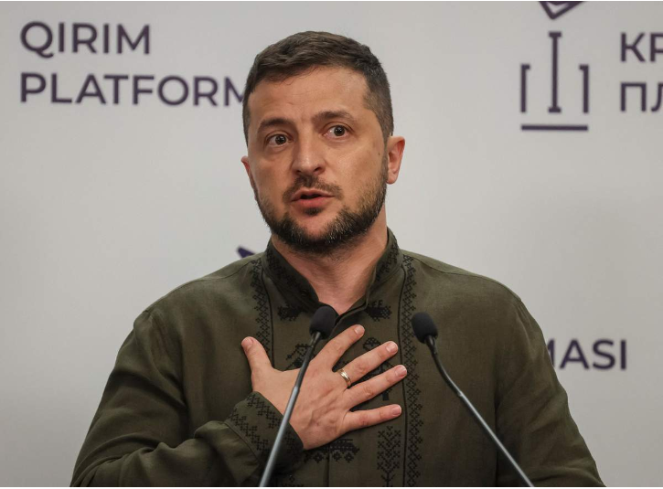

# 今日のニュース (2022-08-26)

### 기사

# **ウクライナ大統領「勝利」目指す　米、追加軍事支援を発表**

**우크라이나 대통령 '승리'를 목표로 미국, 추가 군사 지원 발표**

記者会見するウクライナのゼレンスキー大統領＝２３日、ウクライナ・キーウ（ロイター）
기자회견하는 제렌스키 우크라이나 대통령 = 23일, 우크라이나 키우 (로이터)    

ウクライナのゼレンスキー大統領は２４日、旧ソ連からの独立記念日に合わせたビデオ声明で「戦争は勝利によってのみ終わる」と述べ、ロシアの**侵攻**から同日で半年が経過し、**長期化**する戦争について、**停戦**を**拒否**して**徹底抗戦**を続ける**意思**を改めて示した。

우크라이나의 제렌스키 대통령은 24일, 구소련의 독립 기념일에 맞춘 비디오 성명에서 「전쟁은 승리로만 끝난다」고 말해, 러시아의 침공으로부터 오늘로 반년이 경과해, 장기화하는 전쟁에 대해, 정전을 거부하고 철저히 항전을 계속할 의사를 다시금 보여주었다.

ウクライナメディアが伝えた。

우크라이나 미디어가 전했다.

バイデン米政権は２４日、ウクライナに２９億８千万ドル（約４１００億円）**規模**の追加的な軍事**支援**を**実施**すると発表した。

바이든 미정권은 24일, 우크라이나에 29억 8천만달러(약 4100억엔) 규모의 추가적인 군사 지원을 실시한다고 발표했다.

ゼレンスキー氏は「われわれにとって戦争の終結とは何か。以前は平和といっていたが、今は勝利だ」と強調。

제렌스키는 「우리에게 있어 전쟁의 종결이란 무엇인가. 이전에는 평화라고 했지만, 지금은 승리다」라고 강조.

「われわれはテロリストとの相互理解を求めない」と訴えた。

「우리는 테러리스트와의 상호 이해를 요구하지 않는다」고 호소했다.

露軍は２４日も**攻撃**を**続行**した。

러군은 24일도 공격을 속행했다.

ウクライナ南部ザポロジエ州当局は同日、２３～２４日にかけ、州都ザポロジエ市に露軍のミサイル２発が撃ち込まれたと発表。

우크라이나 남부 자폴로지에 주 당국은 이날, 23~24일에 걸쳐, 주도 자폴로지시에 러군의 미사일 2발이 발사됐다고 발표.

集合住宅の窓が割れるなどの被害が出た。

집합주택 창문이 깨지는 등의 피해가 나왔다.

同市は周辺の**戦闘**で安全が**懸念**されている**欧州**最大級のザポロジエ**原発**から北東に約４０キロ。

시는 주변의 전투에서 안전이 우려되고 있는 유럽 최대급의 자폴로지에 원전으로부터 북동쪽으로 약 40킬로.

ウクライナは独立記念日に合わせた露軍の攻撃を警戒し、首都キーウ（キエフ）で大規模な記念行事を中止した。

우크라이나는 독립 기념일이 맞춘 러군의 공격을 경계하고, 수도 키예프에서 대규모 기념 행사를 중지했다.

露軍の砲撃が続く東部ハリコフ州も２３～２５日まで**夜間**外出禁止令を出している。

러군의 포격이 이어지는 동부 하리코프주도 23~25일까지 야간 외출 금지령을 내리고 있다.

米国の追加軍事支援は露軍の侵攻後、米国が１回に発表する規模で最大とみられ、改めてウクライナを支えていく**決意**を示した。

미국의 추가 군사 지원은 러군의 침공 후, 미국이 한 번 발표하는 규모로 최대로 보였고, 다시 우크라이나를 지지해 나갈 결의를 보였다.

**防空**システムやレーダーなどを**供与**する。

방공 시스템이나 레이더 등을 공여한다.

ジョンソン英首相も２４日、ウクライナを訪問し、**無人機**２０００機を含む５４００万ポンド（約８７億円）相当の追加軍事支援を**表明**。

존슨 영국 총리도 24일, 우크라이나를 방문해, 무인기 2000기를 포함한 5400만 파운드(약 87억엔) 상당의 추가 군사 지원을 표명했다.

ドイツも５億ユーロ（約６８０億円）以上の規模の追加軍事支援を行う**方針**を決めた。

독일도 5억 유로(약 680억엔) 이상의 규모의 추가 군사 지원을 할 방침을 결정했다.

---

### 학습한 단어

|  | 漢字 | 読み仮名 | 意味 |
| --- | --- | --- | --- |
| 1 | 侵攻 | しんこう | 침공 |
| 2 | 長期化 | ちょうきか | 장기화 |
| 3 | 停戦 | ていせん | 정전 |
| 4 | 拒否 | きょひ | 거부 |
| 5 | 徹底 | てってい | 철저 |
| 6 | 抗戦 | こうせん | 항전 |
| 7 | 意思 | いし | 의지 |
| 8 | 規模 | きぼ | 규모 |
| 9 | 支援 | しえん | 지원, 원조 |
| 10 | 実施 | じっし | 실시 |
| 11 | 攻撃 | こうげき | 공격 |
| 12 | 続行 | ぞっこう | 속행 |
| 13 | 戦闘 | せんとう | 전투 |
| 14 | 懸念 | けねん | 괘념, 걱정, 근심, 불안 |
| 15 | 欧州 | おうしゅう | 유럽 |
| 16 | 原発 | げんぱつ | ‘原子力発電所(=원자력 발전소)’의 준말 |
| 17 | 夜間 | やかん | 야간 |
| 18 | 決意 | けつい | 결의, 결심 |
| 19 | 防空 | ぼうくう | 방공 |
| 20 | 供与 | きょうよ | 공여 |
| 21 | 無人機 | むじんき | 無人航空機의 준말: 무인기, 무인 항공기 |
| 22 | 表明 | ひょうめい | 표명 |
| 23 | 方針 | ほうしん | 방침 |

---

### 개인적인 생각

올해 초부터 이어져온 러시아와 우크라이나 간의 전쟁이 장기화되고 있다.

꾸준히 우크라이나에 원조가 있는만큼 얼른 전쟁이 마무리되었으면 하는 바램이다.

---

### 출처

[ウクライナ大統領「勝利」目指す　米、追加軍事支援を発表](https://www.iza.ne.jp/article/20220824-3HM4IY6AJFPEFEBH5ZRNWUJ7IQ/)