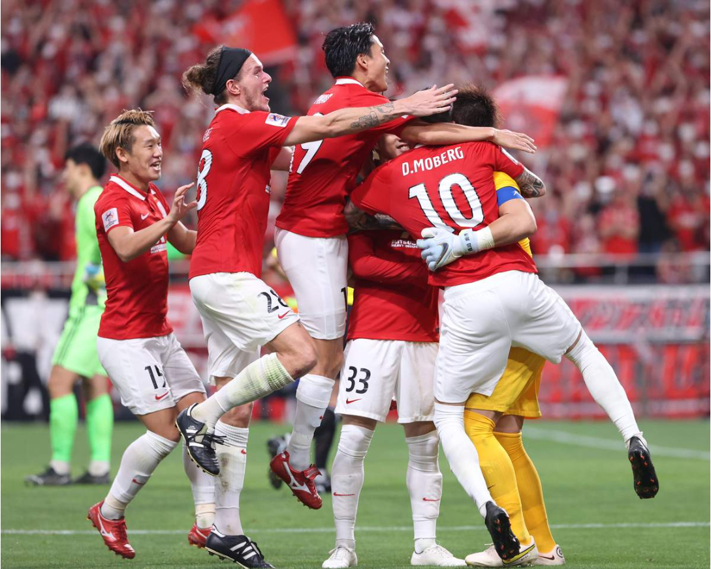

# 今日のニュース (2022-08-27)

### 기사

# **サッカーＡＣＬ、浦和が決勝進出　監督も喜び爆発**

**축구 ACL, 우라와가 결승 진출 감독도 기쁨 폭발**

ＰＫ戦で試合に勝利し、喜び合う浦和イレブン＝埼玉スタジアム（蔵賢斗撮影）

PK전에서 경기에 승리해, 기뻐하는 우라와 일레븐 = 사이타마 스타디움 (쿠라켄토 촬영)    

サッカーのアジア・チャンピオンズリーグ（ＡＣＬ）は２５日、埼玉スタジアムで準決勝（東地区）が行われ、浦和は全北をＰＫ戦の末に**破り**、**決勝**に進出した。

축구 아시아・챔피언스 리그(ACL)은 25일, 사이타마 스타디움에서 준결승(동지구)이 열려, 우라와는 전북을 PK전 끝에 깨고, 결승에 진출했다.

決勝進出を決めると、浦和の選手、スタッフが**歓喜**の**輪**を作る。

결승 진출을 결정하자, 우라와 선수, 스태프가 환희의 고리를 만든다.

ＢＧＭはホームの埼玉スタジアムに駆け付けた２万３２７７人のほとんどを占めた浦和サポーターの**大歓声**。

BGM은 홈 사이타마 스타디움으로 달려온 2만 3277명의 대부분을 차지한 우라와 서포터의 대환성.

３度目のアジア**制覇**に**王手**をかけ、ロドリゲス**監督**は「勝利にふさわしいプレーだった」と喜びを**爆発**させた。

3번째 아시아 제패에 왕수를 걸어, 로드리게스 감독은 「승리에 어울리는 플레이였다」며 기쁨을 폭발시켰다.

**崖っぷち**まで追い込まれながら、最後は勝利をつかみ取った。

벼랑 끝까지 몰리면서, 마지막은 승리를 거두었다.

**延長**後半１１分にオウンゴールで**勝ち越されて**１－２と**敗色濃厚**だった同１５分、相手ＧＫが弾いたシュートのこぼれ球に反応したユンカーが**値千金**の**同点弾**。

연장 후반 11분에 자책골로 1-2로 패색이 짙었던 15분, 상대 골키퍼가 찬 슈팅에 반응한 융카가 천금의 동점탄.

息を吹き返した勢いを持ち込んだＰＫ戦を３－１で制し、**準優勝**だった２０１９年大会以来の決勝にたどり着いた。

살아난 기세를 몰아간 승부차기를 3-1로 누르고, 준우승이었던 2019년 대회 이후 결승에 도달했다.

**低迷打破**を掲げて２０年にスタートさせた３年計画の最終年。

침체 타파를 내걸고 20년에 스타트시킨 3년 계획의 마지막 해.

最大の目標だったＪ１優勝こそ**絶望的**な状況にある。

최대 목표였던 J1 우승이야말로 절망적인 상황이다.

それでもここにきてＪ１で調子を上げ、ＡＣＬとＹＢＣルヴァン・カップでタイトル**獲得**の可能性を残す快進撃は、明るい未来を予感させるのに十分だ。

그럼에도 최근 J1에서 승승장구하고, ACL과 YBC 르뱅컵에서 타이틀 획득 가능성을 열어두는 승승장구는, 밝은 미래를 예감케 하기에 충분하다.

決勝は来年２月に西地区を**勝ち抜いた**クラブとホームアンドアウェーで行われる。

결승은 내년 2월에 서쪽 지구를 이긴 클럽과 홈 앤드 어웨이로 행해진다.

ＰＫ戦で３本を失敗させた**殊勲**のＧＫ西川は「ようやく１９年大会のリベンジをする場所に帰れたという気持ち」と**雪辱**を**誓う**。

승부차기에서 3개를 실패시킨 수훈 골키퍼 니시카와는 「이제야 19년 대회 리벤지를 하는 장소로 돌아왔다는 기분」이라며 설욕을 다짐한다.

日本サッカー界の期待も**背負い**、浦和がアジアの**頂点**を目指す。（奥山次郎）

일본 축구계의 기대도 짊어지고, 우라와가 아시아의 정점을 목표로 한다. (오쿠야마 지로)

---

### 학습한 단어

|  | 漢字 | 読み仮名 | 意味 |
| --- | --- | --- | --- |
| 1 | 破り | やぶり | 깨기, 찢기 |
| 2 | 決勝 | けっしょう | 결승 |
| 3 | 歓喜 | かんき | 환희 |
| 4 | 輪 | わ | 고리, 원형 |
| 5 | 大歓声 | だいかんせい | 대환성 |
| 6 | 制覇 | せいは | 제패 |
| 7 | 王手 | おうて | (장기에서의) 장군, 상대를 궁지에 몰아넣는 마지막 수단 |
| 8 | 監督 | かんとく | 감독 |
| 9 | 爆発 | ばくはつ | 폭발 |
| 10 | 崖っぷち | がけっぷち | 벼랑 끝 |
| 11 | 延長 | えんちょう | 연장 |
| 12 | 勝ち越す | かちこす | 상대보다 더 이기다 |
| 13 | 敗色濃厚 | はいしょくのうこう | 패색이 농후하다 |
| 14 | 値千金 | あたいせんきん | 천금의 값어치 |
| 15 | 同点弾 | どうてんだん | 동점탄 |
| 16 | 準優勝 | じゅんゆうしょう | 준우승 |
| 17 | 低迷 | ていめい | 침체 |
| 18 | 打破 | だは | 타파 |
| 19 | 絶望的 | ぜつぼうてき | 절망적 |
| 20 | 獲得 | かくとく | 획득 |
| 21 | 勝ち抜く | かちぬく | 이겨 내다 |
| 22 | 殊勲 | しゅくん | 수훈 |
| 23 | 雪辱 | せつじょく | 설욕 |
| 24 | 誓う | ちかう | 맹세하다, 서약하다 |
| 25 | 背負い | せおい | 업음 |
| 26 | 頂点 | ちょうてん | 정점 |

---

### 개인적인 생각

한국의 K리그에서도 굉장한 강팀인 전북을 꺾고 ACL 결승에 진출한 우라와 축구팀을 축하하고, 결승에서도 좋은 모습을 보여주면 좋겠다.

---

### 출처

[サッカーＡＣＬ、浦和が決勝進出　監督も喜び爆発](https://www.iza.ne.jp/article/20220826-DOMXSAW5P5NHFNO3R4FEMED62Y/)