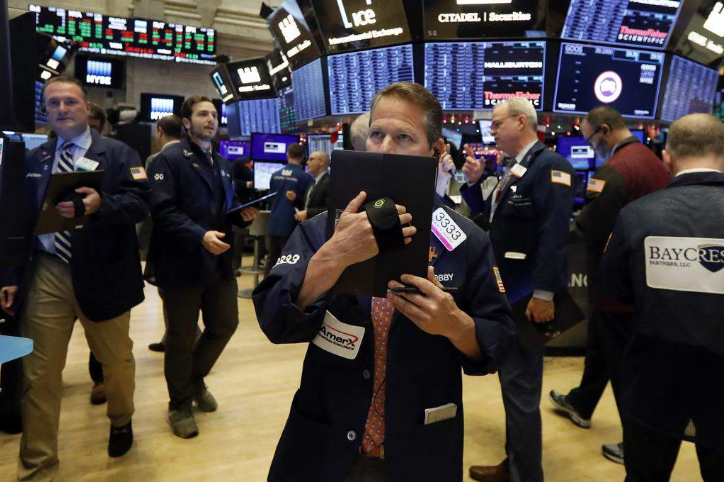

# 今日のニュース (2022-08-28)

### 기사

# **ＮＹ株急落、１０００ドル安　３カ月超ぶり下落幅**

**NY주 급락, 1000달러 저렴 3개월 초과 하락폭**

ニューヨーク**株式市場**のトレーダーたち（ＡＰ）

뉴욕 주식 시장의 트레이더들 (AP)    

２６日のニューヨーク株式市場のダウ**工業株**３０種平均は**急落**し、前日比１００８・３８ドル安の３万２２８３・４０ドルと下落幅は５月中旬以来、３カ月超ぶりの大きさとなった。

26일 뉴욕 주식시장의 다우공업주 30종 평균은 급락했고, 전날 대비 1008・38달러 가량인 3만 2283・40달러로 하락폭은 5월 중순 이래, 3개월 넘게 커졌다.

**終値**としては７月下旬以来の**安値**。

종가로서는 7월 하순 이래의 최저가.

米**連邦**準備制度**理事会**（ＦＲＢ）の**利上げ**加速への**懸念**が高まってリスク**回避**の売りが**膨らみ**、全面安となった。

미연방준비제도이사회(FRB)의 금리인상 가속에 대한 우려가 높아지면서 리스크 회피 매도가 커져, 전면 하락했다.

ＦＲＢのパウエル議長が２６日の講演で、**金融引き締め**に**積極的**な**タカ派姿勢**を示したとの**受け止め**が広がった。

FRB의 파월 의장이 26일 강연에서, 금융 긴축에 적극적인 강경파 자세를 보였다는 해석이 확산됐다.

９月の連邦公開市場委員会（ＦＯＭＣ）で利上げ幅を０・５％に**縮小**することを決め、来年には利下げに**転じる**との金融市場で出ていた**観測**が**後退**した。

9월의 연방 공개 시장 위원회(FOMC)에서 금리 인상폭을 0・5%로 축소하는 것을 결정해 내년에는 금리 인하로 돌아설 것이라는 금융 시장에서 나왔던 관측이 후퇴했다.

米長期**金利**の**指標**となる１０年債利回りは一時３・０８％台まで上昇。

미 장기 금리의 지표가 되는 10년채 이율은 한때 3・08%대까지 상승.

相対的に**割高感**が**意識**されたＩＴ**銘柄**が売られたのが**相場**の下げを**主導**した。（共同）

상대적으로 고가감이 의식된 IT 종목이 팔린 것이 시세의 하락을 주도했다. (공동)

---

### 학습한 단어

|  | 漢字 | 読み仮名 | 意味 |
| --- | --- | --- | --- |
| 1 | 下落幅 | げらくはば | 하락폭 |
| 2 | 株式 | かぶしき | 주식 |
| 3 | 市場 | いちば | 시장 |
| 4 | 工業株 | こうぎょうかぶ | 공업주 |
| 5 | 急落 | きゅうらく | 급락, 폭락 |
| 6 | 終値 | おわりね | (증권 거래소에서의) 종가 |
| 7 | 安値 | やすね | 저가 |
| 8 | 連邦 | れんぽう | 연방 |
| 9 | 理事会 | りじかい | 이사회 |
| 10 | 利上げ | りあげ | 이자 인상, 금리 인상 |
| 11 | 懸念 | けねん | 걱정, 근심 |
| 12 | 回避 | かいひ | 회피 |
| 13 | 膨らみ | ふくらみ | 부풂 |
| 14 | 金融引き締め | きんゆうひきしめ | 금융 긴축 |
| 15 | 積極的 | せっきょくてき | 적극적 |
| 16 | タカ派 | たかは | 강경파 |
| 17 | 姿勢 | しせい | 자세, 태도 |
| 18 | 受け止め | うけとめ | 받아들임 |
| 19 | 縮小 | しゅくしょう | 축소 |
| 20 | 転じる | てんじる | 바뀌다 |
| 21 | 観測 | かんそく | 관측 |
| 22 | 後退 | こうたい | 후퇴 |
| 23 | 金利 | きんり | 금리, 이자 |
| 24 | 指標 | しひょう | 지표 |
| 25 | 割高感 | わりだかかん | 비교적 높은감 |
| 26 | 意識 | いしき | 의식 |
| 27 | 銘柄 | めいがら | 종목 |
| 28 | 相場 | そうば | 시세 |
| 29 | 主導 | しゅどう | 주도 |

---

### 개인적인 생각

국제적인 경제 위기와 함께 주식도 변동폭이 큰 것 같다.
주식 관련한 금융 분야는 지식이 부족하기에 현상황에 대해 상세하게는 모르지만, 잘 개선되었으면 하는 바램이다.

---

### 출처

[ＮＹ株急落、１０００ドル安　３カ月超ぶり下落幅](https://www.iza.ne.jp/article/20220827-DKMSRAGNQFKTRHFZOACYE5TI7U/)