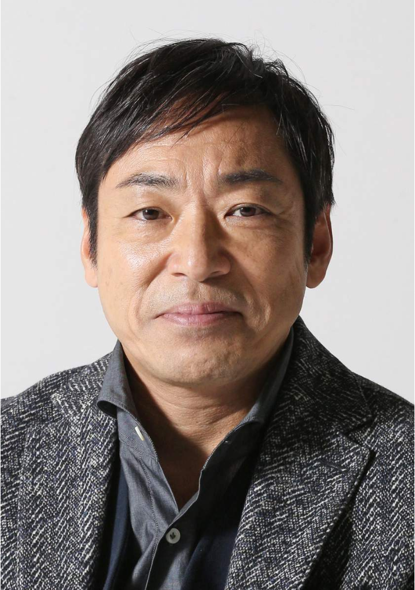

# 今日のニュース (2022-08-30)

### 기사

# **香川照之の性加害報道にＣＭ起用のトヨタ自動車がコメント　「社会的に許されざる行為であり、大変残念」**

**카가와 테루유키의 성 가해 보도에 CM 기용의 도요타 자동차가 코멘트 「사회적으로 용납될 수 없는 행위여서 매우 유감」**

香川照之

카가와 테루유키   

一部**週刊誌**に女性へのセクハラ行為を**報じれられた**俳優、香川照之（５６）について、ＣＭに**起用**しているトヨタ自動車が２６日、サンケイスポーツの**取材**にコメントを発表した。

일부 주간지에 여성에게의 성희롱 행위를 보도받은 배우, 카가와 테루유키(56)에 대해서, CM에 기용하고 있는 도요타 자동차가 26일, 산케이 스포츠의 취재에 코멘트를 발표했다.

同社は

동사는

「香川照之氏に関する一部週刊誌での報道内容ついては、社会的に許されざる**行為**であり、大変残念に思います」

「카가와 테루유키씨에 관한 일부 주간지에서의 보도 내용에 대해서는, 사회적으로 용서되지 않는 행위이며, 매우 유감스럽게 생각합니다.」

とコメント。

라고 답변.

今後の対応については

앞으로의 대응에 대해서는

「本件は、**当事者**間で解決がなされており、また、ご本人も深く反省し、謝罪されていると伺っております。

「본건은 당사자 간에 해결이 이루어지고 있으며, 본인도 깊이 반성하고 사죄하고 있다고 들었습니다.

私どもとしても、今後を**注視**させていただきたいと考えております」

저희로서도, 앞으로를 주시하고 싶습니다.」

とした。

고 했다.

香川をＣＭに**起用**するサントリーなど他の各社も、今後の対応について「まだ何も決まっていない状態」「**検討**中」などとしており、**継続**は**明言**せず。

카가와를 CM에 기용하는 산토리 등 다른 각사도, 향후의 대응에 대해 「아직 아무것도 정해지지 않은 상태」「검토중」 등으로 하고 있어, 계속은 명언하지 않고.

**慎重**に状況を見守っている様子だ。

신중하게 상황을 지켜보고 있는 모습이다.

香川はこの日、金曜**司会**を務めるＴＢＳ系「ＴＨＥ　ＴＩＭＥ，」（月～金曜５・２０）に**出演**し、「自らの行動をしっかりと、深く反省し、**自戒**の念をきっちりと持って、改めてまた日々を務めていきたいと思っています」などと**生謝罪**した。

카가와는 이 날, 금요 사회를 맡는 TBS계 「THE TIME, 」(월~금요일 5・20)에 출연해, 「스스로의 행동을 확실히, 깊게 반성해, 자계의 마음을 확실히 가지고, 재차 또 나날을 맡아가고 싶다고 생각하고 있습니다」 등 생사죄했다.

---

### 학습한 단어

|  | 漢字 | 読み仮名 | 意味 |
| --- | --- | --- | --- |
| 1 | 週刊誌 | しゅうかんし | 주간지 |
| 2 | 報じれられた | ほうじれられた | 보도되었다 |
| 3 | 起用 | きよう | 기용 |
| 4 | 取材 | しゅざい | 취재 |
| 5 | 行為 | こうい | 행위 |
| 6 | 当事者 | とうじしゃ | 당사자 |
| 7 | 注視 | ちゅうし | 주시, 주목 |
| 8 | 起用 | きよう | 기용 |
| 9 | 検討 | けんとう | 검토 |
| 10 | 継続 | けいぞく | 계속 |
| 11 | 明言 | めいげん | 명언, 분명히 말함 |
| 12 | 慎重 | しんちょう | 신중 |
| 13 | 司会 | しかい | 사회 |
| 14 | 出演 | しゅつえん | 출연 |
| 15 | 自戒 | じかい | 자계, 스스로 일깨움, 자숙 |
| 16 | 生謝罪 | なましゃざい | 생사죄 |

---

### 개인적인 생각

일본의 유명한 배우 카가와 테루유키가 성희롱 문제가 화제가 되었다.

한자와 나오키에서 오오와다 상무로 알게 되어 개인적으로 좋아하는 일본 배우 중 한명인데 이번 일을 계기로 충분히 반성하고 더 좋은 작품으로 만나볼 수 있으면 좋겠다.

---

### 출처

[香川照之の性加害報道にＣＭ起用のトヨタ自動車がコメント　「社会的に許されざる行為であり、大変残念」](https://www.iza.ne.jp/article/20220826-SJQXBYD5RFOEZAHXIBSSXTE6ZE/?dicbo=v2-ceb2836668787fdfc818c4f91de94016&obtp_src=www.iza.ne.jp)