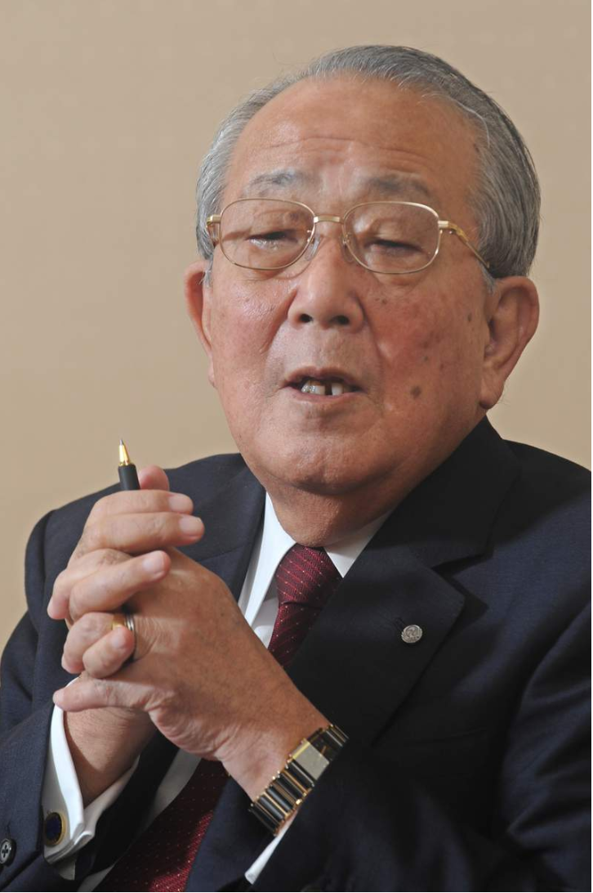

# 今日のニュース (2022-08-31)

### 기사

# **中国メディアで「経営の神」　海外でも稲盛氏たたえる声**

**중국 언론에서 「경영의 신」 해외에서도 그를 기리는 목소리**

京セラの稲盛和夫名誉会長

교세라의 이나모리 카즈오 명예회장   

【北京＝三塚聖平】

【베이징 = 미츠카 세이헤이】

中国メディアは３０日、京セラ**創業者**で**名誉**会長の稲盛和夫氏の死去について**相次いで速報**した。

중국 언론은 30일, 교세라 창업자로 명예회장인 이나모리 카즈오씨의 사망에 대해 잇달아 속보했다.

稲盛氏の**著書**は中国でも多数翻訳されており、経営**哲学**を学んだという中国人経営者が多い。

이나모리의 저서는 중국에서도 다수 번역되고 있어, 경영철학을 배웠다는 중국인 경영자가 많다.

中国インターネットメディアの澎湃（ほうはい）新聞は、「日本の経営の神」が亡くなったと伝えた。

중국 인터넷 미디어의 호우하이 신문은, 「일본 경영의 신」이 사망했다고 전했다.

経営者としての**実績**を紹介しつつ、「中国の**読者**には、その経営の道が知られている」と稲盛氏の経営哲学の影響力の大きさを強調した。

경영자로서의 실적을 소개하면서, 「중국 독자에게는 그 경영의 길이 알려져 있다」고 이나모리의 경영 철학의 영향력의 크기를 강조했다.

中国メディアによると、中国通信機器大手、華為技術（ファーウェイ）の創業者、任正非（にん・せいひ）氏らとも交流があった。

중국 미디어에 의하면, 중국 통신기기 대기업, 화웨이의 창업자, 닌 세이히들과도 교류가 있었다.

中国の**短文**投稿サイト「微博（ウェイボ）」では一時、稲盛氏に関する**話題**が**検索**ランキングで首位となった。

중국의 단문 투고 사이트 「웨이보」에서는 일시, 이나모리에 관한 화제가 검색 랭킹에서 선두가 되었다.

「偉大な企業家」「敬うに値する日本人」といった**追悼**の投稿メッセージが目立つ。

「위대한 기업가」「존경할 만한 일본인」이라는 추도의 투고 메시지가 눈에 띈다.

欧米メディアでは、米ブルームバーグ通信が「**被雇用者**の要求を**株主**の要求より**優先**した」と紹介。

구미 미디어에서는, 미국 블룸버그 통신이 「피고용자의 요구를 주주의 요구보다 우선했다」고 소개.

ＡＰ通信も稲盛氏の**慈善家**の**側面**に**言及**しながら、**巨額負債**を抱えて経営**破綻**した日本航空（ＪＡＬ）の経営**再建**に奔走したことなど、**多面的**な足跡を振り返った。

AP통신도 이나모리의 자선가 측면을 언급하면서, 거액 부채를 안고 경영 파탄한 일본항공(JAL)의 경영 재건에 분주한 것 등, 다면적인 발자취를 뒤돌아봤다.

（北京　三塚聖平）

(베이징 미츠카 세이헤이)

---

### 학습한 단어

|  | 漢字 | 読み仮名 | 意味 |
| --- | --- | --- | --- |
| 1 | 創業者 | そうぎょうしゃ | 창업자 |
| 2 | 名誉 | めいよ | 명예 |
| 3 | 相次いで | あいついで | 연달아, 잇따라 |
| 4 | 速報 | そくほう | 속보 |
| 5 | 著書 | ちょしょ | 저서 |
| 6 | 哲学 | てつがく | 철학 |
| 7 | 実績 | じっせき | 실적 |
| 8 | 読者 | どくしゃ | 독자 |
| 9 | 短文 | たんぶん | 단문 |
| 10 | 話題 | わだい | 화제 |
| 11 | 検索 | けんさく | 검색 |
| 12 | 追悼 | ついとう | 추도 |
| 13 | 被雇用者 | ひこようしゃ | 피고용자 |
| 14 | 株主 | かぶぬし | 주주 |
| 15 | 優先 | ゆうせん | 우선 |
| 16 | 慈善家 | じぜんか | 자선가 |
| 17 | 側面 | そくめん | 측면 |
| 18 | 言及 | げんきゅう | 언급 |
| 19 | 巨額 | きょがく | 거액 |
| 20 | 負債 | ふさい | 부채, 빚 |
| 21 | 破綻 | はたん | 파탄 |
| 22 | 再建 | さいけん | 재건 |
| 23 | 多面的 | ためんてき | 다면적 |

---

### 개인적인 생각

지인이 교세라에 취업하면서 교세라에 대해 알게 되었고, 굉장히 매력적인 기업이라고 알고 있는데, 기업의 창립자가 사망했다는 뉴스를 접하니 조금 안타까운 심정이다.

---

### 출처

[中国メディアで「経営の神」　海外でも稲盛氏たたえる声](https://www.iza.ne.jp/article/20220830-I6Z54J4XMVODZI6NFGA7LJZ2QA/)