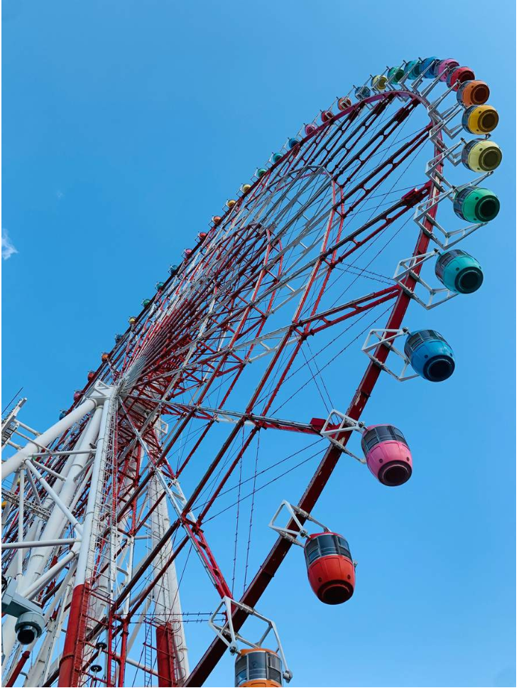

# 今日のニュース (2022-09-01)

### 기사

# **お台場の大観覧車、きょう営業終了　ネットに惜しむ声「妻にプロポーズした思い出の場所」「初めてキスした」**

**오다이바의 대관람차, 오늘 영업 종료 인터넷에 아쉬운 목소리 「아내에게 프로포즈한 추억의 장소」「처음 키스했다」**

東京・お台場のパレットタウン大観覧車

도쿄・오다이바의 팔레트 타운 대관람차   

東京・お台場のランドマークの一つ、パレットタウン**大観覧車**が３１日に**営業**を**終了**する。

도쿄・오다이바의 랜드마크 중 하나, 팔레트타운 대관람차가 31일에 영업을 종료한다.

ＳＮＳには**惜しむ**声が多数寄せられている。

SNS에는 아쉬운 목소리가 다수 전해지고 있다.

パレットタウン大観覧車は１９９９年３月に**開業**。

팔레트타운 대관람차는 199년 3월에 개장.

高さ１１５メートルの日本最大級の観覧車で、開業**当初**はギネス記録に**認定**された。

높이 115m의 일본 최대 관람차로, 개업 당초는 기네스 기록으로 인정됐다.

シースルータイプ４台を含む６４台のゴンドラを**備えて**おり、東京スカイツリーや東京タワーなど都内の名所を**一望**できる。

시스루 타입 4대를 포함해 64대의 곤돌라를 갖추고 있어, 도쿄 스카이트리와 도쿄타워 등 도내 명소를 한눈에 볼 수 있다.

２３年間で約２１００万人が利用したという。

23년간 약 2100만명이 이용했다고 한다.

営業終了は周辺の**再開発**に伴うもので、関連**施設**の「ヴィーナスフォート」は３月に**閉館**した。

영업종료는 주변 재개발에 따른 것으로, 관련 시설인 「비너스 포트」는 3월에 폐관했다.

大観覧車の公式サイトによると、この日の受付は夜７時までだが、**混雑**が予想されることから、**予告**よりも早く受付を終了する可能性もあるという。

대관람차 공식 사이트에 의하면 이날 접수는 밤 7시까지지만, 혼잡이 예상됨에 따라, 예고보다 일찍 접수를 마칠 가능성도 있다고 한다.

イルミネーションの**点灯**は夜９時まで。

일루미네이션의 점등은 밤 9시까지.

**正午**現在の待ち時間は約４０分となっている。

정오 현재 대기 시간은 약 40분이다.

この日、ツイッターでは「台場の大観覧車」がトレンド入り。

이날, 트위터에서는 「다이바의 대관람차」가 대세다.

ＳＮＳには

SNS에는

「シンプルに寂しい。思い出がいっぱいなのよ」

「심플하게 외롭다. 추억이 가득한거야」

「昭和の**痕跡**がほぼ無くなった東京から平成も消えていく」

「쇼와의 흔적이 거의 사라진 도쿄에서 헤이세이도 사라져 간다」

「お台場の**変遷**と共に大学時代～２０代の頃の思い出がいろいろあるなぁ…」

「오다이바의 변천과 함께 대학시절~20대 시절의 추억이 여러 가지 있구나…」

「言葉で**言い表せない**悲しさがあるな」

「말로는 표현할 수 없는 슬픔이 있구나」

などと惜しむ声が相次いだ。

등등 아쉬워하는 소리가 잇따랐다.

これまでに誕生日などの記念日、家族旅行やプロポーズの“**聖地**”として親しまれてきたことから、思い出を書き込むユーザーも多数。

지금까지 생일 등의 기념일, 가족 여행이나 프로포즈의 “성지”로서 사랑받아 온것으로부터, 추억을 쓰는 유저도 다수.

「今の妻にプロポーズした思い出の場所です」

「지금의 아내에게 프로포즈한 추억의 장소입니다」

「私がファーストキスをしたお台場観覧車」

「내가 첫 키스를 했던 오다이바 관람차」

「**修学旅行**のときに初めて女の子とキスした思い出の場所」

「수학여행 때 처음으로 여자아이와 키스한 추억의 장소」

「私の誕生日は家族でいつもお台場の観覧車に乗った。そして旦那との初デートの思い出。さよならお台場観覧車」

「내 생일은 가족끼리 항상 오다이바 관람차를 탔다. 그리고 남편과의 첫 데이트 추억. 안녕 오다이바 관람차」

といったエピソードが寄せられた。

라고 하는 에피소드가 전해졌다.

ほかにも

그 밖에도

「踊る**大捜査線**にハマっていた頃、あの観覧車が見える場所でどれだけ時間を過ごしたことか」

「춤추는 대수사선에 빠져 있었을 무렵, 그 관람차가 보이는 장소에서 얼마나 시간을 보냈는지」

「ありがとうお台場大観覧車…いつもゆりかもめから観覧車とフジテレビみて『お台場だァ』って**お上りさん**みたいな感想してました」

「고마워 오다이바 대관람차… 항상 유리카모메에서 관람차와 후지TV를 보고 「오다이바다」라고 상경한 사람 같은 느낌을 받았어요」

「Ｚｅｐｐ行く時絶対写真撮ってたなぁ〜懐かしい！」

「Zepp 갈 때 꼭 사진 찍었었는데~ 그리워!」

「２０代の時に付き合っていた彼とデートでお台場に行って観覧車に乗ったな〜『東京！』って感じでワクワクしたのを今でも覚えてる」

「20대 때 사귀던 남자친구와 데이트로 오다이바에 가서 관람차를 탔구나~『도쿄!』 라는 느낌에 설레였던 기억이 아직도 난다」

などと、さまざまな**書き込み**が**次々**と寄せられた。

등, 다양한 댓글이 잇따라 올라왔다.

[https://youtu.be/Z4Y4BF1TAc0](https://youtu.be/Z4Y4BF1TAc0)

---

### 학습한 단어

|  | 漢字 | 読み仮名 | 意味 |
| --- | --- | --- | --- |
| 1 | 大観覧車 | だいかんらんしゃ | 대관람차 |
| 2 | 営業 | えいぎょう | 영업 |
| 3 | 終了 | しゅうりょう | 종료 |
| 4 | 惜しむ | おしむ | 아끼다 |
| 5 | 開業 | かいぎょう | 사업을 새로 시작함 |
| 6 | 当初 | とうしょ | 당초, 최초 |
| 7 | 認定 | にんてい | 인정 |
| 8 | 備える | そなえる | 대비하다, 준비하다 |
| 9 | 一望 | いちぼう | 일망 |
| 10 | 再開発 | さいかいはつ | 재개발 |
| 11 | 施設 | しせつ | 시설, 설비 |
| 12 | 閉館 | へいかん | 폐관 |
| 13 | 混雑 | こんざつ | 혼잡 |
| 14 | 予告 | こんざつ | 예고 |
| 15 | 点灯 | てんとう | 점등 |
| 16 | 正午 | しょうご | 정오, 한낮 |
| 17 | 痕跡 | こんせき | 흔적 |
| 18 | 変遷 | へんせん | 변천 |
| 19 | 言い表す | いいあらわす | 말로 나타내다, 표현하다 |
| 20 | 聖地 | せいち | 성지 |
| 21 | 修学旅行 | しゅうがくりょこう | 수학여행 |
| 22 | 大捜査線 | だいそうさせん | 대수사선 |
| 23 | お上りさん | おのぼりさん | (구경하러) 서울로 올라온 시골 사람 |
| 24 | 書き込み | かきこみ | 기입 |
| 25 | 次々 | つぎつぎ | 차례차례 |

---

### 개인적인 생각

여자친구와 오다이바에 데이트하러 간 적이 있는데 그 때 봤던 대관람차는 워낙 예뻤기에 아직까지도 기억에 많이 남아있다.

무척이나 좋아하는 장소였는데 문을 닫는다는 소식을 접하니 안타깝다는 생각이 든다.

---

### 출처

[お台場の大観覧車、きょう営業終了　ネットに惜しむ声「妻にプロポーズした思い出の場所」「初めてキスした」](https://www.iza.ne.jp/article/20220831-M2GC3X7K3VB2VPX2QZ7CEYTRW4/)