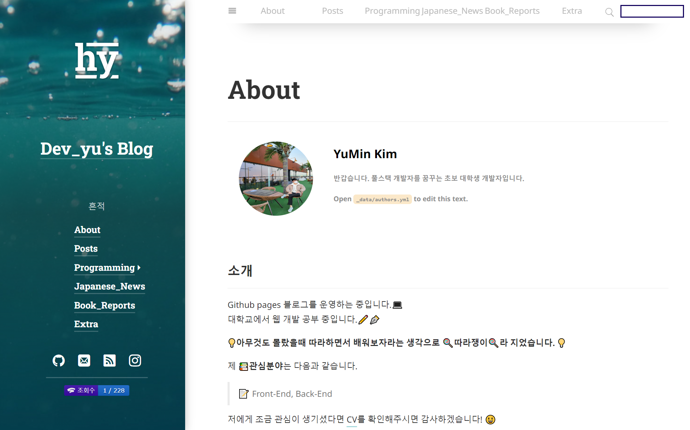

# [Life] 깃블로그 시작! 그 계기는?

### 드디어 깃블로그를 시작하였다!

올해 초, 우연히 유튜브 사윤님의 깃블로그 영상을 보고 “아! 나도 블로그를 시작해야겠다!”라고 다짐하고, 강의를 찾아보며 만들었었다.

하지만, 강의를 참고하며 제작하면서도 이해가 전혀 되지 않았고, 내가 원하는 대로 커스텀이 되지 않아 약 반년간 방치(?)해둔 상태였다…!



---

본격적으로 공부를 시작하고, 방치(?)해둔 블로그 또한 다시 손보기 시작했다! 다양한 선배 개발자분들의 블로그를 참고해보며 결국 깃블로그로 결정하였는데 결정한 이유는 다음과 같다!

**깃블로그**

 **깃블로그의 장점**

```
1. 내 마음대로 커스텀이 가능하다!
   → 나를 한번 좌절시킬만큼 자유도(?)가 높았지만, 결국 나를 표현할 수 있는 공간인만큼 내 입맛대로 블로그를 구성할 수 있다는 점이 매우 매력적으로 다가왔다!

2. 자유로운 포스팅
   → 물론, velog에서 개발 관련 주제가 아닌 포스팅을 올려도 문제가 될 점은 없다. 하지만, velog 자체가 ‘개발자들을 위한 블로그 서비스’ 라는 타이틀을 걸고 나온 플랫폼이고, 이에 걸맞게 대부분 개발 관련 포스팅 뿐이었다. 나는 내 관심 분야들에 대해 제약 없이 올리고 싶었다.

3. 마크다운으로 작성이 가능하다!
   → 강의를 비롯해서 공부를 하면서 노션을 매일같이 사용하는데 노션에서 작성한 글을 추출하여 md 파일로 만들면 바로 포스팅할 수 있다는 점이 좋았다.

4. 깃허브 계정과 연동이 된다!
   → 블로그 포스팅을 통해서도 잔디(?)를 심을 수 있다!
    1일 1커밋을 실천하고 있는 내게 매력적(?)이었다!
```

이에 반해, 단점 또한 존재한다!

 **깃블로그의 단점**

```
1. 진입장벽이 높다.
   → 이미 한번 좌절(?)한 경험이 있는만큼, 다시 시작하는 데에 어려움 또한 존재했다.

2. 관리자 모드가 없어, 블로그의 다양한 통계정보를 확인하기 어렵다.

3. 자유도가 높은만큼 본인이 알아서 위젯을 구성해야 한다.
   → 다양한 테마가 있고, 모두 코드가 다르기 때문에 코드에 익숙치 않은 사람은 커스텀이 높다.
```

깃블로그 이외에도 다양한 블로그 플랫폼이 존재하므로 이들 또한 장단점을 분석해보았다!

---

🗂️ **후보 블로그 플랫폼**

 **네이버 블로그**

```
장점
- 대중적이며, 검색 유입량이 많다.
- UI가 편리하다

단점
- 마크다운을 지원하지 않는다.
- 제한적인 커스터마이징
- 블로그 이전 등을 위한 데이터 내보내기 기능 미지원
```

 **티스토리**

```
장점
- 커스터마이징에 대한 자유도가 높다.
- 마크다운 지원

단점
- 정형화된 레이아웃과 테마
```

 **velog**

```
장점
- 깔끔하다.
- 핵심만 갖춘 기능들
  → 포스팅 목적만으로는 가장 좋지 않을까?
- 개발자가 많다.
  → 개발자분들이 많은만큼 여러 개발자분들의 공부 흔적을 접하기 쉽다!

단점
- 한정적인 기능
  → 블로그로 다양한 것을 구현하고 싶은 내게는 조금 불편하게 다가왔다.
```

---

### 그래서 앞으로는?

앞으로 포스팅할 내용은 주로 3가지로 생각된다.

🗂️ **앞으로의 포스팅**

```md
1. 공부한 내용 정리
2. 일본어로 뉴스 독해 풀이
3. 도서 요약
```

---

### **아직 부족한 부분이 많이 보이지만, 가급적 매일 포스팅할 수 있도록 노력하겠다!**
