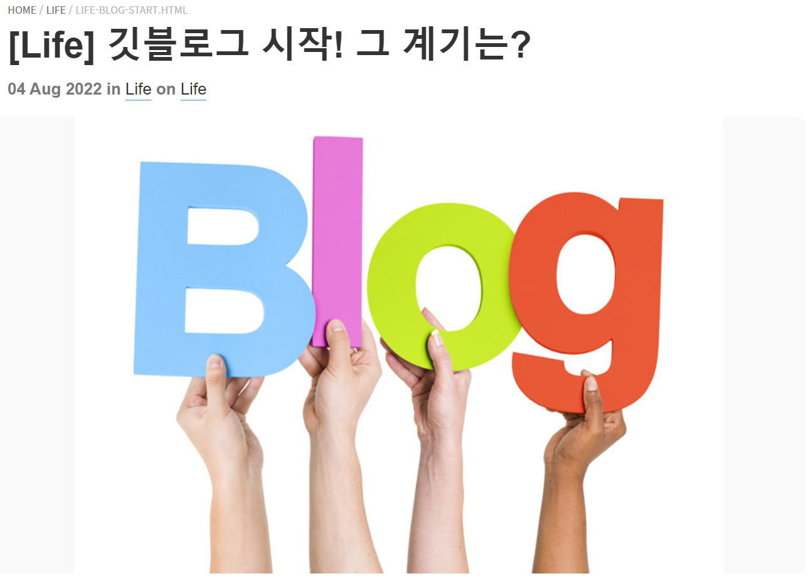

# [Life] 깃블로그 시작 후 1주일이 지났다

**첫 포스팅이 8월 4일이었으니** **깃블로그를 시작한지도 어느덧 일주일이 훌쩍 지났다!**

본격적으로 1일 1포스팅을 꾸준히 실천하다 보니 기존 레이아웃으로는 불편한 부분이 있어 블로그의 레이아웃을 뜯어고치기도 하고, 이전에 Notion으로 정리해뒀던 글들을 포스팅 양식에 맞게 고치다 보니 일주일이라는 시간이 눈 깜짝할 새에 지나가 버렸다.

---

공부한 내용을 꾸준히 블로그에 포스팅하다 보니 당일에 공부한 것을 그날에 마무리하고자 노력하였고, 이는 할 일을 미루지 않도록 하는 데에 도움이 되었다. 또한, 공부하면서 정리한 내용을 블로그에 포스팅하니 분명히 공부한 기억이 있는 내용인데 기억이 나지 않을 때 참고하는 데에도 도움이 되었다!

---

깃허브 또한 50일 넘게 1일 1커밋을 도전하고 있는데 블로그도 예쁘게 가꾸어서  
**나라는 사람을 잘 드러낼 수 있는, 나만의 색을 띨 수 있는 공간이 되면 좋겠다!**