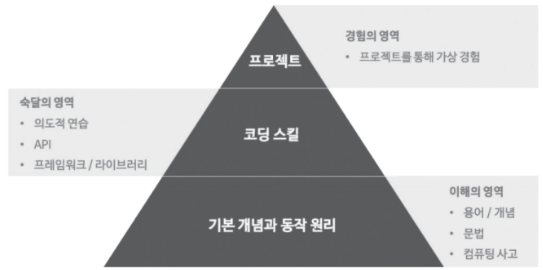

# [Life] 자바스크립트의 효율적 학습 방법

**모던자바스크립트 이웅모님 강연**   

## 자바스크립트의 효율적 학습 방법

### 자바스크립트는 왜 어려울까?

- 프로그래밍은 원래 쉽지 않아요.
- 쉽지 않기 때문에 학습에 시간이 걸립니다.
    - 시간을 많이 투입하면 빨리 성장하지만 그래도 단기간에 급성장하기는 어려울 수 있어요.
- 진입 장벽이 어느 정도 있는  편이기 때문에 타 업종과 비교할 때 대우가 좋은 편입니다.
    - 어느 정도의 진입 장벽이 있다는 것은 유리한 면도 있어요.
    

### 자바스크립트를 어떻게 공부하는 것이 효율적일까?

- “효율적인 학습 방법”은 무엇을 의미할까요?
    - 최소 비용 최대 효과의 원칙(”가장 적은 노력으로 가장 큰 효과를”)이 통할까?
- 투입 시간과 성장은 비례합니다.
- 재능보다 투입 시간이 성장에 더 중요합니다.
- 의식적인 연습을 꾸준히 반복하면 반드시 성장합니다!

### 프로그래밍 수련법

- **메타 인지**
    - 무엇을 모르는지를 아는 것
        - 말로 설명하지 못한다면 모르는 것입니다.
        - 안다고 착각하는 것이 문제입니다.
    - 어려운 것과 익숙치 않은 것은 구분하기 쉽지 않아요.
    - 의식적인 연습을 꾸준히 반복하는 만큼 성장합니다. 즉, 투입된 시간만큼 성장합니다.
    
    → 뭔가 애매한 부분이 있다면 말로 말해보자.
    
- **의식적 연습**
    - 단순한 반복이 아닌 의식적인 연습을 하세요.
        - 라이브 코딩 감상과 예제 단순 타이핑은 연습이 아닙니다.
        - 현재 자신의 능력으로 쉽게 해결 가능한 것을 반복하는 것도 연습이 아닙니다.
        - 자신의 능력을 살짝 넘어서는 도전을 지속적으로 시도하는 것이 연습입니다. 쉬운 도전은 지루하고 무모한 도전은 불안감만 줍니다.
        - 현재 자신의 실력은 객관적으로 알기 어렵기 때문에 멘토가 중요합니다.
    - 시행착오를 두려워 하지 마세요.
        - 시행착오(a.k.a. 삽질)은 “무엇을 알고 무엇을 모르는지”를 알게 하는 개발자의 벗이자 선생님입니다.
        - 무엇을 모르는지 알았다면 몰랐던 것을 알기 위해 “시도하고 실패하는 의식적인 연습을 반복” 하세요.
    - 수박 겉핥기식 학습도 문제지만 본질에서 벗어난 학습도 문제입니다.
        - [야크털 깎기](https://www.lesstif.com/software-engineering/yak-shaving-29590364.html)
        - 앨리스의 토끼굴에 빠졌다.

- **어떻게 하면 될까(HOW) vs. 왜 안될까(WHY)**
    - **왜 안될까**에 대해서 더 생각해야 한다.
    - 구현에 급급하지 말고 문제를 파악하고 원인을 찾자.
    - 되면 왜 되는지, 안되면 왜 안되는지
    - 최선은 무엇일까?
        - for vs. **map**/**filter**/**reduce**👌 ****(imperative vs. declarative)
        - 시간/공간 복잡도 vs. **가독성**👌
        - 좋은 코드란 무엇일까?
            - 주니어 때부터 꾸준한 고민이 필요하다.

- **기본기는 아무리 강조해도 지나침이 없다.**

> 빨리 가는 유일한 방법은 제대로 가는 것이다.
> 
> 
> - 로버트 C. 마틴 (Robert C. Martin), “클린 코드”의 저자
> 

- **태도가 성장을 좌우한다.**
    - 기술과 인성은 반드시 비례하지는 않지만 인성(===태도, !==착함)이 좋으면 성장 가능성이 큽니다.
        - 피드백에 대한 태도(지적 겸손함)
        - 공부하는 태도(성실함)
        - 동료나 강사에 대한 태도(예의)
        - 자기자신에 대한 태도(자존감)
    - 마음가짐
        - 서두르지 마세요. 이제 출발선에 선 것입니다. 성과를 내기엔 아직 이릅니다.
        - 피드백에 적극적으로 겸손하게 반응하여 행동을 교정합시다.
        - 일을 좋아하세요.
            - 좋아하면 관심이 생기고, 관심이 생기면 공부하게 되고, 공부하면 잘하고, 잘하면 칭찬받고, 칭찬받으면 더 잘하고 싶고, 더 잘하면 연봉이 오르고…