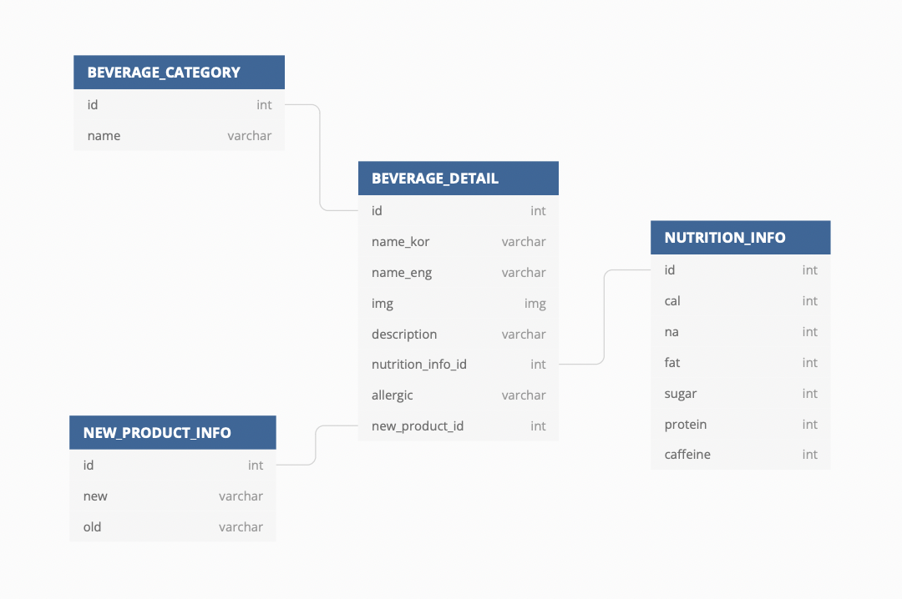

- 데이터베이스의 개념

  - 데이터의 집합소, 데이터의 의미

- DBMS의 뜻, 운영체제

  - 데이터의 집합을 만들고 저장 및 관리할 수 있는 기능들을 제공하는 응용프로그램

- 데이터베이스와 DBMS를 사용하는 이유, 사용목적

  - 데이터의 보존과 체계적 관리
    - 생산성 향상 - CRUD
    - 기능성 - 대용량 데이터 저장, 기능확장 등
    - 신뢰성 - 부하 분산 등

- 관계형 데이터베이스

  - 관계 대수에라는 것에 착안
  - SQL을 사용할 수 있는 데이터베이스

- 관계형 데이터베이스가 사용되는 시스템, 소프트웨어

  - 고유키의 존재

- 관계유형

  - 일대일
  - 일대다
  - 다대다

- 데이터베이스 관계형 모델 제작

  - [데이터베이스 다이어그램](https://dbdiagram.io/)

- 직접 만들어본 스타벅스 음료 카테고리 관련 데이터테이블

